<!--
════════════════════════════════════════════════════════════════════════════════
  SISTEMA BRAILLE INCLUSIVO — ESPEJO DE CONSULTA EN TEXTO PLANO (MARKDOWN)
════════════════════════════════════════════════════════════════════════════════
  AVISO IMPORTANTE (SSOT):
  Este archivo es un ESPEJO DE SOLO LECTURA generado automáticamente a partir de:
  docs/documento_pscp/DocumentoFinalPSCP3DAgosto17.docx

  La ÚNICA FUENTE DE LA VERDAD (SSOT) es el archivo .docx maestro.
  NO modifiques este archivo .md directamente.
  Toda edición debe realizarse sobre el archivo .docx y sincronizarse con:
    bash scripts/docx/exportar_docx_a_md.sh

  Última sincronización: 2026-09-04 20:11:13 UTC
════════════════════════════════════════════════════════════════════════════════
-->

**INSTITUTO TÉCNICO NACIONAL DE COMERCIO**

**“FEDERICO ALVAREZ PLATA” NOCTURNO**

**CARRERA: SISTEMAS INFORMÁTICOS**

**SISTEMA WEB E IMPRESORA 3D CON MATERIALES RECICLADOS PARA LA CREACIÓN DE RECURSOS TÁCTILES DESTINADOS A PERSONAS NO VIDENTES**

> **Proyecto Sociocomunitario productivo para optar el Título de Técnico Superior en Sistemas Informáticos**
>
> **Egr.:**
>
> **Aguilar Castellon Cristhian Alessandro**
>
> **Rosales Mamani Ariel Edson**
>
> **Aramayo Eguino Jose Matias**

**Tutor:** **Ing. Vasquez Cruz Javier Marcelo**

Cochabamba – Bolivia

Agosto 2026

**DEDICATORIA**

A las personas con discapacidad visual de Bolivia, cuya lucha diaria por la inclusión educativa inspiró este proyecto. Que estas páginas contribuyan, aunque sea en pequeña medida, a abrir las puertas del conocimiento a quienes más lo necesitan.

**AGRADECIMIENTOS**

Agradezco al Instituto Técnico Nacional de Comercio «Federico Álvarez Plata», carrera de Sistemas Informáticos, por la formación académica recibida; al Ing. Vasquez Cruz Javier Marcelo por su orientación, paciencia y revisión constante de este trabajo; a las instituciones de educación especial participantes y a sus docentes y estudiantes, por abrirnos sus puertas.

**TABLA DE CONTENIDOS**

# 

[TÍTULO DEL PROYECTO SOCIOCOMUNITARIO PRODUCTIVO [11](#título-del-proyecto-sociocomunitario-productivo)](#título-del-proyecto-sociocomunitario-productivo)

[1. Diagnóstico y justificación [11](#diagnóstico-y-justificación)](#diagnóstico-y-justificación)

[1.1.1. Herramientas aplicadas en el diagnóstico [11](#herramientas-aplicadas-en-el-diagnóstico)](#herramientas-aplicadas-en-el-diagnóstico)

[1.1.2. Árbol de problemas [12](#árbol-de-problemas)](#árbol-de-problemas)

[1.1.3. Análisis FODA [14](#análisis-foda)](#análisis-foda)

[1.2. Justificación [16](#justificación)](#justificación)

[1.2.1. Necesidad y problemática identificada [16](#necesidad-y-problemática-identificada)](#necesidad-y-problemática-identificada)

[1.2.2. Beneficios para la comunidad [16](#beneficios-para-la-comunidad)](#beneficios-para-la-comunidad)

[1.2.3. Impacto multidimensional [17](#impacto-multidimensional)](#impacto-multidimensional)

[1.2.4. Sostenibilidad del proyecto [19](#sostenibilidad-del-proyecto)](#sostenibilidad-del-proyecto)

[1.2.5. Planteamiento y formulación del problema técnico [19](#planteamiento-y-formulación-del-problema-técnico)](#planteamiento-y-formulación-del-problema-técnico)

[1.3. Marco teórico [21](#marco-teórico)](#marco-teórico)

[1.3.1. El sistema Braille y la discapacidad visual [21](#el-sistema-braille-y-la-discapacidad-visual)](#el-sistema-braille-y-la-discapacidad-visual)

[1.3.2. Tecnología de impresión 3D y control numérico computarizado [26](#tecnología-de-impresión-3d-y-control-numérico-computarizado)](#tecnología-de-impresión-3d-y-control-numérico-computarizado)

[Filamento PLA. [27](#_Toc237875108)](#_Toc237875108)

[1.3.3. Plataformas web, economía circular y metodologías de desarrollo [30](#plataformas-web-economía-circular-y-metodologías-de-desarrollo)](#plataformas-web-economía-circular-y-metodologías-de-desarrollo)

[1.4. Enfoque metodológico [35](#enfoque-metodológico)](#enfoque-metodológico)

[1.4.1. Métodos [35](#métodos)](#métodos)

[• Método analítico-sintético: [35](#_Toc237875112)](#_Toc237875112)

[• Método deductivo: [36](#_Toc237875113)](#_Toc237875113)

[• Método inductivo: [36](#_Toc237875114)](#_Toc237875114)

[1.4.2. Técnicas [36](#técnicas)](#técnicas)

[2. CONTEXTO DE REALIZACIÓN (LOCALIZACIÓN) [37](#contexto-de-realización-localización)](#contexto-de-realización-localización)

[3. ACTORES QUE INTERVIENEN [38](#actores-que-intervienen)](#actores-que-intervienen)

[3.1. Comunidad educativa [39](#comunidad-educativa)](#comunidad-educativa)

[3.2. Autoridades comunitarias e institucionales [40](#autoridades-comunitarias-e-institucionales)](#autoridades-comunitarias-e-institucionales)

[3.3. Estudiantes, docentes y padres de familia [40](#estudiantes-docentes-y-padres-de-familia)](#estudiantes-docentes-y-padres-de-familia)

[4. BENEFICIARIOS PRIMARIOS Y SECUNDARIOS [40](#beneficiarios-primarios-y-secundarios)](#beneficiarios-primarios-y-secundarios)

[4.1. Beneficiarios primarios [41](#beneficiarios-primarios)](#beneficiarios-primarios)

[4.2. Beneficiarios secundarios [41](#beneficiarios-secundarios)](#beneficiarios-secundarios)

[5. OBJETIVOS: GENERAL Y ESPECÍFICOS [42](#objetivos-general-y-específicos)](#objetivos-general-y-específicos)

[5.1. Objetivo General [42](#objetivo-general)](#objetivo-general)

[5.2. Objetivos Específicos [42](#objetivos-específicos)](#objetivos-específicos)

[5.3. Alcances [43](#alcances)](#alcances)

[5.3.1. MÓDULO 1: Gestión de Usuarios [43](#módulo-1-gestión-de-usuarios)](#módulo-1-gestión-de-usuarios)

[5.3.2. MÓDULO 2: Traducción Automática Texto→Braille y Previsión Visual 2D [44](#módulo-2-traducción-automática-textobraille-y-previsión-visual-2d)](#módulo-2-traducción-automática-textobraille-y-previsión-visual-2d)

[5.3.3. MÓDULO 3: Gestión de Pedidos y Costos de Producción [44](#módulo-3-gestión-de-pedidos-y-costos-de-producción)](#módulo-3-gestión-de-pedidos-y-costos-de-producción)

[5.3.4. MÓDULO 4: Catálogo Digital de Producción Educativa Táctil [45](#módulo-4-catálogo-digital-de-producción-educativa-táctil)](#módulo-4-catálogo-digital-de-producción-educativa-táctil)

[5.3.5. MÓDULO 5: Hardware CNC Electromecánico [45](#módulo-5-hardware-cnc-electromecánico)](#módulo-5-hardware-cnc-electromecánico)

[5.3.6. MÓDULO 6: Validación Sociocomunitaria [46](#módulo-6-validación-sociocomunitaria)](#módulo-6-validación-sociocomunitaria)

[5.4. Límites del Sistema [46](#límites-del-sistema)](#límites-del-sistema)

[6. PLAN DE ACCIÓN [49](#plan-de-acción)](#plan-de-acción)

[6.1. Propiedades [49](#propiedades)](#propiedades)

[6.2. Recursos Necesarios [50](#recursos-necesarios)](#recursos-necesarios)

[6.3. Posibles Obstáculos y Cómo Superarlos [51](#posibles-obstáculos-y-cómo-superarlos)](#posibles-obstáculos-y-cómo-superarlos)

[6.3.1. Distribución de Roles del Equipo [51](#distribución-de-roles-del-equipo)](#distribución-de-roles-del-equipo)

[6.3.2. Tabla del Plan de Acción por Fases [53](#tabla-del-plan-de-acción-por-fases)](#tabla-del-plan-de-acción-por-fases)

[6.4. Cronograma de actividades (Diagrama de Gantt) [55](#cronograma-de-actividades-diagrama-de-gantt)](#cronograma-de-actividades-diagrama-de-gantt)

[6.5. Cronograma detallado de implementación [55](#cronograma-detallado-de-implementación)](#cronograma-detallado-de-implementación)

[6.6. Presupuesto estimado total [57](#presupuesto-estimado-total)](#presupuesto-estimado-total)

[7. EJECUCIÓN, SEGUIMIENTO Y MONITOREO [59](#ejecución-seguimiento-y-monitoreo)](#ejecución-seguimiento-y-monitoreo)

[7.1. Actividades ejecutadas [59](#actividades-ejecutadas)](#actividades-ejecutadas)

[7.2. Participación comunitaria [59](#participación-comunitaria)](#participación-comunitaria)

[7.3. Desarrollo técnico del producto (si aplica) [60](#desarrollo-técnico-del-producto-si-aplica)](#desarrollo-técnico-del-producto-si-aplica)

[7.3.1. Análisis de requerimientos [60](#análisis-de-requerimientos)](#análisis-de-requerimientos)

[7.3.2. Diagramas UML [62](#diagramas-uml)](#diagramas-uml)

[7.3.3. Tecnologías utilizadas [86](#tecnologías-utilizadas)](#tecnologías-utilizadas)

[7.4. Herramientas de seguimiento [86](#herramientas-de-seguimiento)](#herramientas-de-seguimiento)

[7.5. Dificultades y soluciones aplicadas [86](#dificultades-y-soluciones-aplicadas)](#dificultades-y-soluciones-aplicadas)

[8. RESULTADOS OBTENIDOS [87](#resultados-obtenidos)](#resultados-obtenidos)

[8.1. Resultados cualitativos [87](#resultados-cualitativos)](#resultados-cualitativos)

[8.2. Resultados cuantitativos [87](#resultados-cuantitativos)](#resultados-cuantitativos)

[8.3. Impacto en la comunidad [87](#impacto-en-la-comunidad)](#impacto-en-la-comunidad)

[9. CONCLUSIONES [87](#conclusiones)](#conclusiones)

[10. Recomendaciones [87](#recomendaciones)](#recomendaciones)

[11. FUENTES DE INFORMACIÓN Y BIBLIOGRAFÍA [88](#fuentes-de-información-y-bibliografía)](#fuentes-de-información-y-bibliografía)

[12. ANEXOS [91](#anexos)](#anexos)

**\**

**ÍNDICE DE TABLAS**

[Tabla 1. Análisis F.O.D.A. del sistema propuesto. [15](#_Toc237875161)](#_Toc237875161)

[Tabla 2.Impacto multidimensional proyectado del sistema. [17](#_Toc237875162)](#_Toc237875162)

[Tabla 3. Correspondencias del alfabeto en Braille Grado 1 (español).3 [23](#_Toc237875163)](#_Toc237875163)

[Tabla 4.Componentes del sistema de control electrónico del hardware. [28](#_Toc237875164)](#_Toc237875164)

[Tabla 5.Stack tecnológico del sistema web y herramientas de desarrollo. [31](#_Toc237875165)](#_Toc237875165)

[Tabla 6.Actores institucionales, comunitarios y académicos del proyecto. [38](#_Toc237875166)](#_Toc237875166)

[Tabla 7.Caracterización de los beneficiarios del proyecto. [40](#_Toc237875167)](#_Toc237875167)

[Tabla 8.Distribución de roles y responsabilidades del equipo de desarrollo. [52](#_Toc237875168)](#_Toc237875168)

[Tabla 9.Plan de acción detallado por fases del proyecto. [53](#_Toc237875169)](#_Toc237875169)

[Tabla 10.Cronograma detallado con criterios de verificación. [55](#_Toc237875170)](#_Toc237875170)

[Tabla 11.Presupuesto estimado total del proyecto. [57](#_Toc237875171)](#_Toc237875171)

[Tabla 12.Distribución del presupuesto estimado por categoría de gasto. [58](#_Toc237875172)](#_Toc237875172)

[Tabla 13. Casos de Uso [63](#_Toc237875173)](#_Toc237875173)

**ÍNDICE DE FIGURAS**

[Figura 1.Árbol de problemas del proyecto. [13](#_Toc237875174)](#_Toc237875174)

[Figura 2. Diagrama de Gantt [55](#_Toc237875175)](#_Toc237875175)

[Figura 3. Diagrama General de Casos de Uso [64](#_Toc237875176)](#_Toc237875176)

[Figura 4. UC-01: Iniciar/Cerrar Sesión [65](#_Toc237875177)](#_Toc237875177)

[Figura 5. UC-02: Gestionar Recursos [66](#_Toc237875178)](#_Toc237875178)

[Figura 6. UC-03: Ver Catálogo [68](#_Toc237875179)](#_Toc237875179)

[Figura 7. UC-04: Gestionar Instituciones [69](#_Toc237875180)](#_Toc237875180)

[Figura 8. UC-05: Gestionar Usuarios [71](#_Toc237875181)](#_Toc237875181)

[Figura 9. UC-06: Traducir Texto a Braille [73](#_Toc237875182)](#_Toc237875182)

[Figura 10. UC-07: Solicitar Impresión [75](#_Toc237875183)](#_Toc237875183)

[Figura 11. UC-08: Gestionar Solicitudes [76](#_Toc237875184)](#_Toc237875184)

[Figura 12. UC-09: Descargar G-Code [78](#_Toc237875185)](#_Toc237875185)

[Figura 13. UC-10: Reportes y Estadísticas [79](#_Toc237875186)](#_Toc237875186)

[Figura 14. Diagrama de Clases [81](#_Toc237875187)](#_Toc237875187)

[Figura 15. Diagrama de Estados del Pedido [82](#_Toc237875188)](#_Toc237875188)

[Figura 16. Diagrama de Despliegue (Topología Física) [83](#_Toc237875189)](#_Toc237875189)

[Figura 17. Diagrama ER de Base de Datos. [85](#_Toc237875190)](#_Toc237875190)

**RESUMEN**

El presente Proyecto Sociocomunitario Productivo desarrolla un sistema web e impresora 3D con materiales reciclados para la creación de recursos educativos táctiles —fichas Braille, mapas, figuras geométricas y reglas—, destinados a estudiantes con discapacidad visual de instituciones de educación especial del municipio de Cochabamba, Bolivia. El sistema integra una plataforma web desarrollada en Laravel/PHP con un algoritmo propio de traducción texto→Braille Grado 1 y generación de Código G, y un hardware cartesiano tipo Prusa i3 controlado por Arduino Mega 2560 con firmware Marlin 1.1.x, ensamblado con madera local y componentes electrónicos recuperados de residuos tecnológicos (e-waste). El diagnóstico identificó como problema central el acceso limitado a material educativo táctil en Braille —las embozadoras comerciales cuestan más de \$3,000 USD y el papel Braille tradicional pierde su relieve con el uso frecuente— brecha que afecta la equidad educativa de esta población. La solución propuesta reduce el costo de producción de un recurso educativo táctil (ficha Braille o modelo didáctico) a aproximadamente Bs. 5 (≈ \$0.72 USD), automatiza la transcripción de más de 60 minutos manuales a menos de 5 minutos por página, y reutiliza entre 2 y 3 kg de residuos electrónicos por máquina construida, articulando inclusión educativa con economía circular. El proyecto se valida mediante pruebas piloto con el Instituto Boliviano de la Ceguera (IBC). El presupuesto total estimado es de ~700 Bs. (≈ \$100 USD), representando una reducción del 96,7% respecto al costo de las embozadoras (impresoras Braille de papel) y los equipos comerciales de producción táctil.

Palabras clave: Braille, impresión 3D, inclusión educativa, discapacidad visual, e-waste, código abierto, economía circular, accesibilidad, Arduino, firmware Marlin.

**INTRODUCCIÓN**

El presente documento describe el desarrollo del Proyecto Sociocomunitario Productivo «SISTEMA WEB E IMPRESORA 3D CON MATERIALES RECICLADOS PARA LA CREACIÓN DE RECURSOS TÁCTILES DESTINADOS A PERSONAS NO VIDENTES», ejecutado por los egresados de la carrera de Sistemas Informáticos del Instituto Técnico Nacional de Comercio «Federico Álvarez Plata», turno nocturno, sede Cochabamba, durante el período mayo–septiembre de 2026. El proyecto se enmarca en la modalidad de titulación por Proyecto Sociocomunitario Productivo, establecida en el Reglamento de Modalidades de Graduación del Subsistema de Educación Superior (RM 0487/2023), y responde a la necesidad de vincular la formación técnica superior con problemáticas concretas del entorno mediante soluciones tecnológicas sustentables, reproducibles y de bajo costo.

La relevancia social del proyecto se sustenta en el marco normativo boliviano —particularmente la Ley N° 223 y el Decreto Supremo N° 1893— que garantiza el derecho a la educación inclusiva de las personas con discapacidad. Su relevancia tecnológica reside en la demostración de que es posible construir, con hardware libre y software de código abierto, una solución funcional, durable y reproducible a una fracción del costo de las alternativas comerciales. El presente documento aspira a servir como referencia metodológica para futuros proyectos que articulen tecnología, inclusión y sostenibilidad ambiental en el contexto educativo boliviano.

# TÍTULO DEL PROYECTO SOCIOCOMUNITARIO PRODUCTIVO

**SISTEMA** **WEB E IMPRESORA 3D CON MATERIALES RECICLADOS PARA LA CREACIÓN DE RECURSOS TÁCTILES DESTINADOS A PERSONAS NO VIDENTES**

# Diagnóstico y justificación

**1.1 Diagnóstico**

El diagnóstico representa un análisis sistemático y crítico de la realidad social y tecnológica de la comunidad beneficiaria. Su elaboración permitió identificar con precisión el problema abordado, las causas que lo originan y los efectos que genera en la comunidad destinataria. Para el presente proyecto, el diagnóstico se centró en la realidad educativa de las personas con discapacidad visual en el municipio de Cochabamba, particularmente en las instituciones de educación especial que atienden a esta población.

### Herramientas aplicadas en el diagnóstico

Para obtener un diagnóstico preciso, participativo y verificable de la realidad educativa de las personas con discapacidad visual en Cochabamba, se aplicaron las siguientes herramientas metodológicas de investigación, seleccionadas por su pertinencia con el enfoque sociocomunitario productivo del proyecto:

**Investigación documental:** Se revisaron los costos actuales de embozadoras y equipos comerciales de producción táctil (que superan los \$3,000 USD), los estándares internacionales del sistema Braille (Braille Authority of North America \[BANA\], 2013; UEB), la Ley N° 223 de inclusión educativa boliviana, el Decreto Supremo N° 1893 y proyectos similares documentados en la comunidad RepRap y en repositorios académicos de universidades latinoamericanas.

**Observación participante:** se realizaron visitas diagnósticas directas a centros de educación especial del municipio de Cochabamba, con el objetivo de identificar la disponibilidad de material táctil Braille, el estado del material existente y las condiciones del entorno de aprendizaje de los estudiantes con discapacidad visual.

**Entrevistas semiestructuradas:** se llevaron a cabo entrevistas con docentes de educación especial, directivos institucionales y especialistas del Instituto Boliviano de la Ceguera (IBC), mediante una guía de preguntas prediseñada, con el fin de comprender las dificultades prácticas en la producción de material Braille y las necesidades pedagógicas específicas.

**Encuestas estructuradas:** se aplicaron cuestionarios con preguntas cerradas a dos grupos: docentes de educación especial y estudiantes con discapacidad visual, para cuantificar la dimensión del problema y validar la propuesta tecnológica. Los formularios de encuesta se presentan en los Anexos C y D.

**Análisis FODA:** se elaboró una matriz de Fortalezas, Oportunidades, Debilidades y Amenazas para evaluar las condiciones internas del proyecto y el entorno externo en el que se desarrolló, facilitando la definición de estrategias de intervención.

**Árbol de problemas:** se construyó un árbol de problemas para identificar el problema central, sus causas raíces y sus consecuencias directas e indirectas, lo que permitió definir con claridad el alcance y los límites de la intervención propuesta.

### Árbol de problemas

Con base en la investigación documental y las visitas diagnósticas realizadas, se elaboró el siguiente árbol de problemas que identifica el problema central, sus causas estructurales y sus consecuencias directas para la comunidad educativa beneficiaria del presente proyecto:

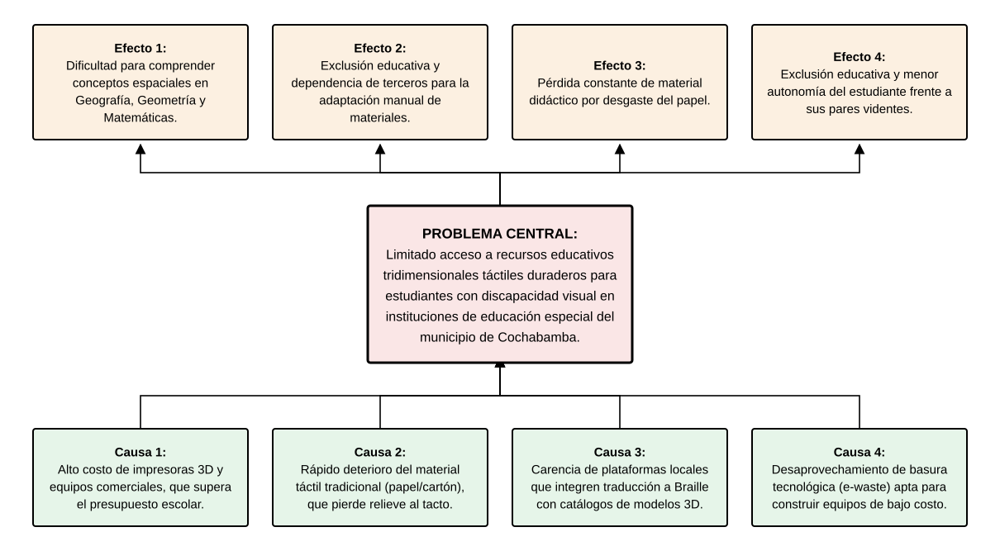Figura 1.Árbol de problemas del proyecto.

Fuente: Elaboración propia.

**Problema Central:**  Limitado acceso a recursos educativos tridimensionales táctiles duraderos para estudiantes con discapacidad visual en instituciones de educación especial del municipio de Cochabamba.

**Causas (Raíces):**

- Alto costo de las impresoras 3D y equipos de relieve comercial, que supera el presupuesto para material didáctico de las unidades educativas especiales.

- Rápido deterioro del material táctil tradicional (papel punzado o cartón), que pierde el relieve con el tacto frecuente.

- Carencia de plataformas locales accesibles que integren la traducción automatizada a Braille con un catálogo de modelos 3D educativos listos para fabricar.

- Desaprovechamiento de la basura tecnológica (e-waste) disponible en la región, que contiene componentes electrónicos reutilizables aptos para la construcción de equipamiento de bajo costo.

**Consecuencias (Ramas):**

- Dificultad para comprender conceptos espaciales en asignaturas como Geografía, Geometría y Matemáticas por falta de modelos físicos tridimensionales.

- Exclusión educativa y dependencia de terceros para la adaptación manual de materiales.

- Pérdida constante de material didáctico por desgaste del papel.

- Exclusión educativa y menor autonomía del estudiante con discapacidad visual respecto a sus pares videntes.

A partir de este diagnóstico, se plantea la siguiente interrogante que guiará el proyecto:

¿En qué medida el desarrollo de un sistema web e impresora 3D con materiales reciclados optimiza la producción, reduce los costos y mejora el acceso a recursos educativos táctiles para personas con discapacidad visual en instituciones de educación especial del municipio de Cochabamba?

### Análisis FODA

El análisis FODA (Fortalezas, Oportunidades, Debilidades y Amenazas) es una herramienta de diagnóstico estratégico que permite evaluar las condiciones internas del proyecto y el entorno externo en el que se desarrollará, facilitando el diseño de estrategias que maximicen las fortalezas y oportunidades, y mitiguen el efecto de las debilidades y amenazas identificadas (Ponce Talancón, 2006):

<table>
<caption>
Tabla 1. Análisis F.O.D.A. del sistema propuesto.
</caption>
<colgroup>
<col style="width: 49%" />
<col style="width: 50%" />
</colgroup>
<thead>
<tr>
<th style="text-align: center;"><strong>FORTALEZAS</strong></th>
<th style="text-align: center;"><strong>OPORTUNIDADES</strong></th>
</tr>
</thead>
<tbody>
<tr>
<td>
• F1. Integración de hardware libre (Arduino/RAMPS 1.4) con software a medida.

• F2. Uso de materiales reciclados (e-waste) que reducirán el costo en más del 90%.

• F3. Equipo multidisciplinario: desarrollo web y ensamblaje electromecánico.

• F4. Algoritmo de traducción texto→Braille propio, sin software propietario.

• F5. Chasis de madera barnizada que mitigará el pandeo por humedad ambiental.
</td>
<td>
• O1. Ley N° 223 y D.S. 1893 que respaldan la inclusión educativa en Bolivia.

• O2. Alta disponibilidad de

• componentes electrónicos reciclables (e-waste) en la región.

• O3. Interés institucional del Instituto Boliviano de la Ceguera (IBC).

• O4. Creciente demanda de material táctil en unidades educativas inclusivas.

• O5. Posibilidad de replicar el modelo en otras instituciones a nivel nacional.
</td>
</tr>
<tr>
<td style="text-align: center;"><strong>DEBILIDADES</strong></td>
<td style="text-align: center;"><strong>AMENAZAS</strong></td>
</tr>
<tr>
<td>
• D1. Curva de aprendizaje en la calibración térmica del extrusor.

• D2. Dependencia de conexión a internet para la plataforma web traductora.

D3. Variabilidad en la calidad de componentes recuperados de e-waste.

D4. El traductor cubrirá únicamente Braille Grado 1 en la fase inicial.
</td>
<td>
• A1. Fluctuación en el costo del filamento PLA biodegradable en el mercado local.

• A2. Posible resistencia inicial de docentes al uso de nuevas plataformas digitales.

A3. Posible aparición de soluciones comerciales de menor precio.

A4. Riesgo de pandeo de madera en temporada de lluvias.
</td>
</tr>
</tbody>
</table>

Fuente: Elaboración propia.

## Justificación

La justificación explica los motivos y circunstancias que llevaron a priorizar este proyecto dentro del contexto sociocomunitario del municipio de Cochabamba, tomando en cuenta la necesidad identificada en el diagnóstico, sus causas estructurales y los beneficios concretos que se espera generar para la comunidad en los ámbitos social, tecnológico, económico y ecológico.

### Necesidad y problemática identificada

El proyecto surge en respuesta a una brecha crítica identificada durante el diagnóstico: el limitado acceso a recursos educativos táctiles en Braille afecta directamente la calidad del aprendizaje y la equidad educativa de los estudiantes con discapacidad visual en Cochabamba. La creación manual de textos Braille es lenta (más de 60 minutos por página), el papel punzado se deteriora con el tacto frecuente, y las embozadoras (impresoras Braille de papel) y los equipos comerciales de producción táctil tienen costos superiores a los \$3,000 USD, completamente inaccesibles para las unidades educativas fiscales del departamento.

Paralelamente, existe en la región una acumulación significativa de basura electrónica (e-waste) que no recibe una segunda vida útil productiva: motores paso a paso NEMA 17, varillas de acero, fuentes de poder ATX y otros componentes de impresoras y escáneres en desuso. Este proyecto aprovecha esos recursos para construir una solución tecnológica de bajo costo que resuelve ambas problemáticas de forma simultánea, articulando la inclusión educativa con la sostenibilidad ambiental.

### Beneficios para la comunidad

Para los estudiantes con discapacidad visual: accederán a mapas táctiles, figuras geométricas, reglas y textos en Braille impresos en relieve de plástico duro (PLA), un material de alta durabilidad que no se aplana con el tacto frecuente, mejorando su autonomía y calidad de aprendizaje en materias como Geografía, Matemáticas y Ciencias Naturales.

Para los docentes de educación especial: dispondrán de una plataforma web que les permitirá ingresar texto en lenguaje natural y generar material Braille impreso sin necesidad de conocimientos técnicos en el sistema Braille, reduciendo el tiempo de producción de más de 60 minutos a menos de 5 minutos por página.

Para el medio ambiente: se reutilizarán motores, varillas, fuentes de poder y otros componentes electrónicos desechados, reduciendo el impacto de la basura tecnológica en la región mediante un modelo de economía circular que otorgará segunda vida útil a componentes funcionales recuperados.

Para las instituciones educativas: podrán diversificar su oferta de material didáctico táctil sin depender de donaciones externas ni de presupuestos inaccesibles, con un costo de producción de aproximadamente Bs. 5 por modelo táctil, frente a los más de Bs. 150 que cuesta un recurso equivalente mediante servicios comerciales de embosado.

### Impacto multidimensional

El proyecto genera beneficios que trascienden el ámbito educativo, impactando positivamente en diversas dimensiones de la comunidad cochabambina. La tabla siguiente resume los impactos proyectados y los indicadores que permiten verificar su alcance durante y después de la implementación:

| **Ámbito** | **Beneficio Proyectado** | **Indicador de Impacto** |
|:--:|:--:|----|
| Social | Promoverá la equidad educativa permitiendo que estudiantes con discapacidad visual accedan al mismo contenido curricular que sus pares videntes. | Reducción de la brecha de exclusión educativa en instituciones de educación especial. |
| Tecnológico | Democratizará el acceso a tecnología de fabricación digital en entornos educativos públicos bolivianos de bajos recursos. | Primer sistema de provisión de material didáctico táctil impreso en 3D desarrollado localmente en Bolivia. |
| Económico | Reducirá en más del 90% el costo de adquisición de equipos comerciales de producción de material táctil (embozadoras desde ~\$1,495 ) frente al proyecto (~\$200). | Ahorro estimado de Bs. 20,000 por institución en equipamiento comercial. |
| Ecológico | Otorgará segunda vida útil a componentes electrónicos en desuso, promoviendo economía circular en la región. | Reutilización de 2 a 3 kg de componentes electrónicos por máquina construida. |
| Educativo | Facilitará la labor pedagógica automatizando la traducción a Braille y la parametrización de piezas didácticas 3D sin requerir que el docente posea conocimientos de diseño CAD. | Reducción del tiempo de esfuerzo activo del docente en la elaboración manual de materiales tridimensionales, pasando de varias horas de trabajo manual a cero esfuerzo de diseño mediante la automatización de la plataforma. |

Tabla 2.Impacto multidimensional proyectado del sistema.

Fuente: Elaboración propia.

### Sostenibilidad del proyecto

Para garantizar la continuidad del proyecto más allá de la fase de desarrollo, se han definido las siguientes estrategias de sostenibilidad:

- **Modelo escalable y de código abierto:** el código fuente de la plataforma web, los planos estructurales de la impresora 3D y el catálogo de modelos G-Code se publicarán bajo licencia Creative Commons, permitiendo su replicación gratuita en otras instituciones educativas del país sin costos adicionales de licencia o equipamiento.

- **Alianzas estratégicas:** se buscará la firma de un convenio de colaboración con el Instituto Boliviano de la Ceguera (IBC) para la validación continua del material producido, la expansión del catálogo educativo táctil y la capacitación de docentes usuarios.

### Planteamiento y formulación del problema técnico

Desde la perspectiva técnica, el problema central identificado en el diagnóstico se traduce en la necesidad de diseñar, construir y validar un sistema cartesiano de impresión 3D (arquitectura Prusa i3) que, integrado con una plataforma web de traducción automática, permita la producción automatizada de recursos didácticos tridimensionales y placas con relieves Braille en filamento PLA de alta durabilidad, con resolución espacial submilimétrica y a una fracción del costo de las soluciones comerciales disponibles en el mercado internacional.

**Problema técnico formulado:**

¿Cómo diseñar e implementar un sistema de impresión 3D de bajo costo, basado en hardware libre Arduino/RAMPS 1.4 y componentes electromecánicos recuperados de e-waste, controlado mediante un firmware Marlin 1.1.x y alimentado por archivos G-Code generados internamente por una plataforma web, que sea capaz de fabricar objetos didácticos y placas de PLA con relieves Braille duraderos con precisión submilimétrica, garantizando la legibilidad táctil conforme a los estándares de lectura especial?

El problema técnico se descompone en los siguientes subproblemas operacionales, que serán resueltos por los módulos correspondientes del sistema:

- **Calibración de la cinemática de los ejes X, Y, Z con motores NEMA 17 reciclados:** definición de parámetros *steps/mm*, corrientes de conducción en controladores A4988 y velocidades máximas que aseguren la repetibilidad y precisión en el posicionamiento de la boquilla del extrusor.

- **Optimización del proceso de extrusión para relieves de baja altura (0.5–0.8 mm):** ajuste de la distancia inicial de la boquilla a la cama de impresión fría (eje Z), temperatura de fusión del termoplástico y velocidad de deposición para garantizar una perfecta adherencia del PLA sobre la cinta azul de pintor o laca adhesiva, previniendo deformaciones o desprendimientos en la base de la pieza.

- **Desarrollo del algoritmo de traducción texto→Braille Grado 1:** implementación en el backend de la plataforma web de la matriz de correspondencias del alfabeto Braille estándar y su conversión automática a coordenadas espaciales tridimensionales en milímetros.

- **Generación de archivos G-Code válidos para Marlin 1.1.x:** compilación interna de instrucciones G0/G1 con coordenadas absolutas y control de extrusión relativo (G92 E0) compatible con la cinemática Prusa i3, empaquetando el archivo en el servidor para su posterior descarga exclusiva por el operador.

- **Integración Web–Hardware mediante flujo manual de datos:** almacenamiento organizado de los archivos G-Code generados en la base de datos del servidor web de forma vinculada a cada pedido, permitiendo al operador su descarga manual y transferencia física a la impresora 3D mediante conexión USB directa desde la PC del operador.

## Marco teórico

El marco teórico expone los fundamentos conceptuales, científicos y normativos que sustentan el presente Proyecto Sociocomunitario Productivo. Su elaboración permite contextualizar la propuesta tecnológica dentro del estado del arte internacional, justificar las decisiones técnicas adoptadas en el diseño del sistema y demostrar la viabilidad de la solución propuesta sobre la base de evidencia académica verificable. Se organiza en cinco ejes temáticos complementarios: (1.4.1) el sistema Braille y la discapacidad visual como dominio de aplicación; (1.4.2) la tecnología de impresión 3D y control numérico computarizado como sustrato técnico del hardware; (1.4.3) la economía circular y la gestión de residuos electrónicos como marco de sostenibilidad ambiental; (1.4.4) las herramientas de desarrollo de software como infraestructura técnica de la plataforma web; y (1.4.5) las metodologías de desarrollo ágil como marco de gestión del proyecto. La articulación de estos cinco ejes proporciona una base teórica coherente que respalda cada decisión de diseño y cada línea del presupuesto estimado.

### El sistema Braille y la discapacidad visual

El primer eje teórico se ocupa del dominio de aplicación: el sistema Braille como código de lecto-escritura táctil, la discapacidad visual como condición humana atendida, y la inclusión educativa como objetivo sociopolítico del proyecto.

**Origen y estructura del sistema Braille**

El sistema Braille es un método de lecto-escritura táctil creado por el francés Louis Braille (1809–1852), quien perdió la vista a los tres años de edad a causa de un accidente. Siendo estudiante en el Institut National de Jeunes Aveugles de París, Braille adaptó y perfeccionó el código nocturno militar de doce puntos diseñado por el capitán Charles Barbier, reduciendo la celda a seis puntos organizados en una matriz de dos columnas y tres filas. El sistema fue completado en 1824, cuando Braille contaba apenas 15 años, y fue publicado por primera vez en 1829. Tras décadas de resistencia institucional, el Braille fue oficialmente adoptado en Francia en 1854, dos años después del fallecimiento de su inventor, y se extendió progresivamente a todos los países del mundo como el estándar universal de comunicación escrita para personas con discapacidad visual (Mellor, 2006).

La celda Braille está compuesta por seis puntos en relieve dispuestos en dos columnas y tres filas, numerados del 1 al 6 de arriba hacia abajo, comenzando por la columna izquierda (puntos 1, 2, 3) y continuando por la columna derecha (puntos 4, 5, 6). Dado que cada punto puede estar presente o ausente de forma independiente, el número total de combinaciones posibles es 2⁶ = 64, incluyendo la celda vacía. Esta arquitectura binaria simple es suficiente para codificar el alfabeto completo, los dígitos del 0 al 9, los signos de puntuación y los indicadores de mayúsculas y números, lo que convierte al Braille en un sistema eficiente, compacto y aprendible con relativa rapidez por personas que han perdido la visión.

**Dimensiones físicas y codificación.**

Las dimensiones estándar de una celda Braille, establecidas por la Braille Authority of North America (BANA, 2013), son aproximadamente 6 mm de alto por 3 mm de ancho. Cada punto tiene un diámetro de 1.44 mm en la base y una altura de relieve mínima de 0.48 mm para ser percibido correctamente por el tacto. El espaciado horizontal entre el centro de dos puntos adyacentes en la misma fila (dot pitch horizontal) es de 2.34 mm, y el espaciado vertical (entre filas de puntos) es de 2.34 mm. Entre celdas adyacentes, el espacio en blanco horizontal es de 0.84 mm, y entre líneas de texto, el espacio vertical entre la parte inferior de los puntos superiores de una celda y la parte superior de los puntos inferiores de la siguiente línea es de 5.08 mm (BANA, 2013). Estas dimensiones son críticas para garantizar que el lector Braille pueda discriminar con precisión cada punto mediante el dedo índice, que tiene una resolución táctil de aproximadamente 1–2 mm.

En el presente proyecto, la impresora 3D deposita relieves de filamento PLA con boquilla de 0.8 mm, lo que permite aproximarse a las dimensiones estándar de la BANA (2013), manteniendo la legibilidad táctil. Los puntos se generan como pequeñas columnas cilíndricas de 1.5 mm de diámetro y 0.6 mm de altura, valores validados en proyectos de la comunidad RepRap como EmbossedBraille y similares.

**Grados del sistema Braille.**

El sistema Braille se organiza en dos niveles principales de complejidad según el grado de contracción empleado. El Braille Grado 1 o Braille Alfabético es el nivel más básico: cada carácter del texto original se transcribe directamente a su celda Braille correspondiente, sin abreviaciones. Es el sistema empleado para la enseñanza inicial a personas que aprenden Braille y para la producción de material didáctico elemental, razón por la cual ha sido seleccionado como el estándar del presente proyecto. La tabla siguiente muestra las correspondencias del alfabeto en Braille Grado 1 para el español:

| **Letras a–e** | **Letras f–j** | **Letras k–o** | **Letras p–t** | **Letras u–z y ñ** |
|----|----|----|----|----|
| a = ⠁ | f = ⠋ | k = ⠅ | p = ⠏ | u = ⠥ |
| b = ⠃ | g = ⠛ | l = ⠇ | q = ⠟ | v = ⠧ |
| c = ⠉ | h = ⠓ | m = ⠍ | r = ⠗ | w = ⠺ |
| d = ⠙ | i = ⠊ | n = ⠝ | s = ⠎ | x = ⠭ |
| e = ⠑ | j = ⠚ | o = ⠕ | t = ⠞ | y = ⠽ |
| z = ⠵ | ñ = ⠻ |  |  |  |
| 1 = ⠼⠁ | 2 = ⠼⠃ | 3 = ⠼⠉ | 4 = ⠼⠙ | 5 = ⠼⠑ |
| 6 = ⠼⠋ | 7 = ⠼⠛ | 8 = ⠼⠓ | 9 = ⠼⠊ | 0 = ⠼⠚ |
| . = ⠲ | , = ⠂ | ; = ⠆ | : = ⠒ | ? = ⠦ |
| ! = ⠖ | \- = ⠤ | ' = ⠄ | ¿ = ⠦ | " = ⠶ |

Tabla 3. Correspondencias del alfabeto en Braille Grado 1 (español).3

Fuente: Elaboración propia.

El Braille Grado 2 o Braille Contractado introduce contracciones y abreviaciones que permiten comprimir el texto hasta en un 30%, acelerando la velocidad de lectura y reduciendo el espacio físico ocupado por el texto transcrito. Sin embargo, su aprendizaje requiere la memorización de decenas de reglas de contracción adicionales, por lo que se reserva para lectores avanzados y publicaciones de distribución masiva. El módulo de traducción del presente sistema se limita exclusivamente al Grado 1 en su versión inicial, como se especifica en los límites del proyecto (sección 5.4).

**Estándares internacionales y normativa.**

La Unified English Braille (UEB) es el código Braille adoptado oficialmente en 2016 por la Braille Authority of North America (BANA, 2013) y utilizado en más de diez países de habla inglesa. Para el español, el sistema de referencia es el Código Braille Español publicado por la Organización Nacional de Ciegos Españoles (ONCE), que establece las correspondencias específicas para los caracteres del idioma español, incluyendo las vocales acentuadas (á, é, í, ó, ú), la ñ, la ü y los signos de interrogación y exclamación de apertura característicos del español (¿, ¡). El algoritmo de traducción del presente proyecto se basa en la tabla de correspondencias del Código Braille Español, que coincide en los caracteres básicos con la UEB y es el referente estándar en los centros educativos bolivianos que trabajan con material Braille.

**Definición y clasificación de la discapacidad visual.**

La Organización Mundial de la Salud (OMS, 2023) define la discapacidad visual como la limitación de la función visual, y la clasifica según el nivel de agudeza visual corregida en cuatro categorías: visión normal (agudeza ≥ 0.3), visión moderadamente deteriorada (agudeza entre 0.1 y 0.3), visión gravemente deteriorada (agudeza \< 0.1 pero \> 0.05) y ceguera (agudeza \< 0.05 o campo visual \< 10°). Esta última categoría, conocida como ceguera legal, es la condición de la mayoría de los beneficiarios directos del presente proyecto, quienes dependen exclusivamente de recursos táctiles y auditivos para acceder a la información escrita (OMS, 2023).

En su informe de 2023, la Organización Mundial de la Salud (2023) estima que en el mundo hay aproximadamente 2,200 millones de personas con discapacidad visual, de las cuales al menos 1,000 millones podrían haberse evitado o no han sido tratadas. En América Latina y el Caribe, la prevalencia de la discapacidad visual representa el 3.4% de la población total. En Bolivia, el Censo Nacional de Población y Vivienda del Instituto Nacional de Estadística (Instituto Nacional de Estadística, 2012) registró 87,320 personas con discapacidad visual, concentradas principalmente en los departamentos de La Paz, Cochabamba y Santa Cruz. Este último dato, aunque con más de una década de antigüedad, constituye la única fuente estadística oficial disponible a nivel nacional y es el referente cuantitativo empleado en el diagnóstico del presente proyecto.

**Marco normativo boliviano para la inclusión educativa.**

Bolivia cuenta con un marco normativo sólido que reconoce los derechos de las personas con discapacidad y establece obligaciones concretas para el Estado en materia de educación inclusiva: la Ley de Educación N° 070 (2010); la Constitución Política del Estado Plurinacional (CPE, 2009), en sus artículos 70 y 71, reconoce el derecho a una educación intracultural, intercultural y plurilingüe; la Ley N° 223 – Ley General para Personas con Discapacidad (2012) establece en su artículo 28 el derecho a una educación inclusiva y la obligación del Estado de proveer materiales adaptados; el Decreto Supremo N° 1893 (2014) reglamenta la Ley N° 223 y define la responsabilidad de los municipios en la provisión de herramientas tecnológicas adaptadas; y la Agenda 2030 – ODS 4 (Naciones Unidas, 2015) compromete a Bolivia con la meta de una educación inclusiva, equitativa y de calidad para todos. Este marco normativo otorga sustento jurídico al presente proyecto y justifica la inversión de recursos tecnológicos para mejorar las condiciones de acceso a material educativo táctil en las instituciones de educación especial del municipio de Cochabamba.

**Materiales táctiles y recursos pedagógicos accesibles.**

Los materiales táctiles son recursos pedagógicos diseñados específicamente para ser percibidos mediante el sentido del tacto, en sustitución o complemento de los recursos visuales convencionales. Para los estudiantes con discapacidad visual, estos materiales incluyen textos en Braille, mapas en relieve, figuras geométricas tridimensionales, gráficos embossed, reglas táctiles y modelos anatómicos. Su disponibilidad es determinante para garantizar la equidad educativa y la autonomía del estudiante en el aula (Ministerio de Educación de Bolivia, 2018). El principal problema de los materiales táctiles tradicionales fabricados en papel punzado es su baja durabilidad: los relieves de papel Braille se aplanan con el uso táctil frecuente en un período de pocas semanas, obligando a su reposición constante. Los materiales impresos en PLA, en cambio, mantienen su relieve indefinidamente al estar fabricados en un termoplástico rígido, lo que representa una ventaja técnica y económica significativa para las instituciones de educación especial.

### Tecnología de impresión 3D y control numérico computarizado

El segundo eje teórico se ocupa del sustrato técnico del hardware del proyecto: la manufactura aditiva, el proceso de deposición de material fundido (FDM), las propiedades del filamento PLA, la arquitectura cartesiana Prusa i3 y el firmware de control Marlin.

**Antecedentes y evolución de la impresión 3D.**

La impresión 3D, formalmente denominada manufactura aditiva (Gibson et al., 2015; ISO/ASTM 52900, 2021), es una tecnología que construye objetos tridimensionales mediante la deposición sucesiva de capas de material a partir de un modelo digital. Su origen se remonta a 1986, cuando Charles Hull patentó la estereolitografía (SLA), el primer proceso de manufactura aditiva que utilizaba resina fotopolimérica solidificada por rayos ultravioleta. Posteriormente, en 1989, Scott Crump patentó la Deposición de Material Fundido (FDM, Fused Deposition Modeling), empleando filamento termoplástico extruido a alta temperatura. El hito más relevante para el presente proyecto es el RepRap Project (RepRap Community, 2005), iniciado en 2005 por el Dr. Adrian Bowyer en la Universidad de Bath, Reino Unido. RepRap (Replicating Rapid Prototyper) fue el primer proyecto de código abierto que desarrolló una impresora 3D FDM de bajo costo con la capacidad de autorreplicarse. Este modelo democratizó globalmente la tecnología de impresión 3D y originó el ecosistema de hardware abierto del que deriva la arquitectura empleada en el presente proyecto. La variante de diseño Prusa i3, desarrollada por Josef Prusa en 2012, se convirtió en el diseño de referencia más popular del mundo por su simplicidad de ensamblaje, bajo costo y fácil mantenimiento (Evans, 2021).

**Proceso FDM.**

El proceso FDM funciona de la siguiente manera: el filamento termoplástico, almacenado en un carrete, es alimentado por un mecanismo de arrastre (extrusor cold-end) hacia un bloque calefactor (hot-end) donde se funde a temperaturas de entre 170°C y 240°C según el material. El plástico fundido es extruido a través de una boquilla de diámetro controlado (en este proyecto, 0.8 mm) y depositado sobre la superficie de trabajo en la posición X, Y, Z especificada por las instrucciones del archivo G-Code. Al enfriarse, el material se solidifica y adhiere a la capa anterior, construyendo el objeto capa a capa desde la base hacia arriba.

***Filamento PLA.***

El ácido poliláctico (PLA) es un biopolímero termoplástico biodegradable obtenido a partir del almidón de maíz, caña de azúcar o mandioca mediante fermentación bacteriana. Fue desarrollado comercialmente en los años 1990 y se convirtió en el material más utilizado en impresión 3D FDM de escritorio por sus propiedades de procesamiento favorables: temperatura de fusión relativamente baja (170–220°C), ausencia de deformación por enfriamiento (warping) en piezas pequeñas, baja toxicidad de las emisiones durante la impresión, fácil adhesión entre capas y rigidez estructural suficiente para aplicaciones de baja carga mecánica (Evans, 2021). Para la producción de relieves Braille, el PLA presenta una ventaja crítica sobre el papel Braille punzado tradicional: los relieves de PLA son permanentes y no se aplanan con el uso táctil frecuente, dada la rigidez del material (módulo de Young ≈ 3.5 GPa). Un relieve Braille en PLA correctamente impreso puede resistir miles de lecturas táctiles sin degradación apreciable.

**Arquitectura cartesiana y firmware Marlin.**

La arquitectura cartesiana de la máquina del presente proyecto se basa en el diseño Prusa i3, que organiza el movimiento en tres ejes ortogonales independientes: Eje X (horizontal): el carro del extrusor se desplaza sobre dos varillas horizontales mediante correa GT2 y polea dentada accionada por un motor NEMA 17, con resolución de 80 pasos/mm con microstepping 1/16. Eje Y (frontal/trasero): la cama de impresión se desplaza en profundidad sobre dos varillas frontales mediante correa GT2, con resolución de 80 pasos/mm. Eje Z (vertical): el extrusor asciende y desciende mediante un husillo M8 con paso de rosca de 1.25 mm/vuelta, con resolución de 4000 pasos/mm (0.025 mm de resolución). El firmware Marlin es el software de código abierto más utilizado en el mundo para el control de impresoras 3D RepRap. Se ejecuta sobre el microcontrolador Arduino Mega 2560 e interpreta en tiempo real el archivo G-Code generado por la plataforma web. La configuración específica del proyecto incluye: steps/mm X=80, Y=80, Z=4000, E0=95; termistor tipo 1 (NTC 100K MK8); cama caliente desactivada; y velocidades máximas de 100 mm/s en X e Y y 5 mm/s en Z (Marlin Contributors, 2023).

**Hardware electrónico de control.**

El sistema de control electrónico del hardware integra varios componentes especializados que trabajan de forma coordinada para ejecutar con precisión las instrucciones del archivo G-Code. La siguiente tabla detalla cada componente, su función específica y la especificación técnica relevante para el proyecto:

| **Componente** | **Tipo** | **Especificación** | **Función en el Sistema** |
|:--:|:--:|----|----|
| Arduino Mega 2560 | Microcontrolador | ATmega2560 16 MHz | Unidad central de procesamiento del firmware Marlin |
| RAMPS 1.4 | Shield de control | Shield para Arduino Mega | Gestiona conexiones de motores, termistores y sensores |
| Drivers A4988 (×4) | Control de motores | 1/16 microstepping | Controlan individualmente cada motor NEMA 17 |
| Motores NEMA 17 (×4) | Actuadores | 1.8°/paso, 4 kg·cm | Cuatro motores: uno por eje (X, Y, Z) y uno para el extrusor (E), recuperados de e-waste |
| Extrusor MK8 | Deposición de material | Boquilla 0.8 mm | Funde y deposita filamento PLA. |
| Finales de carrera (×3) | Sensores de posición | Endstops mecánicos | Referencia de posición home en cada eje |
| Fuente ATX reciclada | Alimentación | 12V / 20A mín. | Provee energía a motores y electrónica de control |
| Varillas ø8mm + LM8UU | Guías de movimiento | Acero templado | Guían el desplazamiento lineal de carros X, Y, Z |

Tabla 4.Componentes del sistema de control electrónico del hardware.

Fuente: Elaboración propia.

El Arduino Mega 2560 es una plataforma de desarrollo de microcontroladores basada en el chip ATmega2560 de Atmel (ahora Microchip Technology), un microcontrolador de arquitectura RISC de 8 bits con 256 KB de memoria flash para el programa, 8 KB de SRAM para datos y 4 KB de EEPROM para configuración. Opera a 16 MHz y dispone de 54 pines de entrada/salida digital (15 con soporte PWM), 16 entradas analógicas y cuatro puertos UART para comunicación serial. Su capacidad de procesamiento es suficiente para ejecutar el firmware Marlin 1.1.x en tiempo real, gestionando simultáneamente el control de cuatro motores paso a paso, la lectura de termistores y sensores, la comunicación serial con el PC (Arduino AG, 2023). Los motores NEMA 17 son motores de paso a paso bipolares con un marco estándar de 42.3 mm × 42.3 mm, con un ángulo de paso nominal de 1.8° por pulso eléctrico (200 pasos por revolución). Son extremadamente comunes en equipos de ofimática y constituyen el componente e-waste de mayor disponibilidad y valor en la región de Cochabamba.

### Plataformas web, economía circular y metodologías de desarrollo

El tercer eje teórico articula tres dimensiones complementarias: el stack tecnológico que sustenta la plataforma web, el marco conceptual de economía circular que justifica la recuperación de e-waste, y las metodologías de desarrollo ágil que guiaron la ejecución del proyecto.

**Economía circular y gestión de residuos electrónicos.**

Los Residuos de Aparatos Eléctricos y Electrónicos (RAEE), denominados internacionalmente e-waste, comprenden todos los dispositivos con componente eléctrico o electrónico que han llegado al fin de su vida útil. Según el Global E-Waste Monitor 2020 elaborado por la Universidad de las Naciones Unidas (UNU), en 2019 se generaron 53.6 millones de toneladas métricas de e-waste a nivel mundial, de las cuales solo el 17.4% fue recogido y reciclado de forma documentada. Se estima que para 2030 esta cifra alcanzará los 74.7 millones de toneladas. El e-waste contiene materiales de alto valor recuperable (cobre, aluminio, acero, circuitos integrados, motores), pero también sustancias peligrosas (plomo, mercurio, cadmio) que contaminan el suelo y los recursos hídricos cuando se disponen de forma inadecuada. En Bolivia, la Ley N° 755 de Gestión Integral de Residuos (2015) establece el marco legal para la gestión de RAEE, pero la ausencia de infraestructura formal de reciclaje en la mayoría de los departamentos —incluyendo Cochabamba— hace que la mayor parte del e-waste generado termine en la basura doméstica.

La economía circular es un modelo económico que propone reemplazar el paradigma lineal de «producir-usar-desechar» por un ciclo de valor cerrado en el que los materiales y productos se mantienen en uso el mayor tiempo posible, recuperando y regenerando su valor al final de cada ciclo de vida. Sus principios fundamentales son: diseñar sin residuos y sin contaminación, mantener los productos y materiales en uso (mediante reparación, reutilización y remanufactura) y regenerar los sistemas naturales (Ellen MacArthur Foundation, 2013). El presente proyecto aplica directamente el principio de reutilización: los motores NEMA 17, las varillas de acero ø8 mm, las fuentes de poder ATX y otros componentes recuperados de equipos informáticos en desuso se reintegran como componentes funcionales en la máquina, reduciendo el costo del hardware en más del 60% y desviando entre 2 y 3 kg de residuos electrónicos por máquina construida del flujo de residuos hacia un circuito de valor productivo.

**Stack tecnológico del sistema web.** El sistema web del proyecto se desarrolla sobre un stack de tecnologías de código abierto moderno, escalable y ampliamente documentado. La selección de cada tecnología responde a criterios de disponibilidad gratuita, madurez del ecosistema, curva de aprendizaje acorde al perfil del equipo de desarrollo y compatibilidad entre componentes. La tabla siguiente resume el stack tecnológico completo y el rol de cada componente en el sistema:

| **Tecnología / Herramienta** | **Categoría** | **Versión / Tipo** | **Rol en el Proyecto** |
|:--:|:--:|----|----|
| Laravel 13 / PHP 8.3 | Framework Backend | MVC, RESTful | Arquitectura web, rutas, controladores, ORM Eloquent |
| MySQL 8.0 | Base de Datos | RDBMS Relacional | Almacenamiento de usuarios, pedidos, modelos táctiles |
| Laravel Service (PHP) | Backend / Lógica | App\Services\BrailleTranslator | Algoritmo de traducción texto→Braille y generación G-Code |
| AdminLTE 3 + Bootstrap 4 | Frontend / UI | HTML5, CSS3, JS | Interfaz de usuario responsiva conforme a WCAG 2.1 |
| Docker / Compose | Contenedores | Plataforma cruzada | Entorno de desarrollo y despliegue reproducible |
| Git / GitHub | Control de versiones | Distribuido | Gestión de código fuente, ramas y pull requests |
| Marlin 1.1.x | Firmware | Open Source | Control del hardware: movimiento, temperatura, extrusión |
| VS Code | IDE | Multiplataforma | Editor principal de código para backend y frontend |
| Trello | Gestión de proyecto | Kanban / Scrum | Tablero de tareas, backlog y seguimiento de sprints |

Tabla 5.Stack tecnológico del sistema web y herramientas de desarrollo.

Fuente: Elaboración propia.

**Arquitectura MVC y framework Laravel.**

El patrón de arquitectura Modelo-Vista-Controlador (MVC) es el estándar dominante en el desarrollo de aplicaciones web modernas. Separa las responsabilidades de la aplicación en tres capas independientes: el Modelo (lógica de negocio y acceso a datos), la Vista (presentación e interfaz de usuario) y el Controlador (coordinación entre Modelo y Vista en respuesta a las solicitudes del usuario). Esta separación facilita el mantenimiento del código, la detección de errores y la escalabilidad de la aplicación. Laravel es el framework PHP de código abierto más utilizado en el mundo (según JetBrains Developer Survey 2023), desarrollado por Taylor Otwell y lanzado en 2011. Implementa el patrón MVC de forma elegante y proporciona componentes integrados para gestión de rutas, autenticación, validación de formularios, migraciones de base de datos, envío de correos electrónicos y generación de PDFs. Su ORM (Object-Relational Mapping) Eloquent permite interactuar con la base de datos MySQL mediante objetos PHP sin necesidad de escribir consultas SQL manualmente, acelerando significativamente el desarrollo y reduciendo los riesgos de vulnerabilidades de inyección SQL (OWASP Foundation, 2021; Pressman y Maxim, 2020).

**Accesibilidad web y estándares WCAG 2.1.**

Las Pautas de Accesibilidad para el Contenido Web (WCAG, Web Content Accessibility Guidelines) son el estándar internacional de accesibilidad web elaborado por el World Wide Web Consortium (W3C, 2018). La versión 2.1, publicada en 2018, establece los criterios de éxito organizados en cuatro principios: Perceptible, Operable, Comprensible y Robusto. La plataforma web del presente proyecto se diseñó para cumplir el nivel de conformidad AA de las WCAG 2.1, lo que implica: relación de contraste mínima de 4.5:1 entre texto y fondo, etiquetas ARIA para elementos de formulario, mensajes de error descriptivos, navegación completa mediante teclado sin dependencia del ratón, textos alternativos para imágenes y evitación de contenido intermitente que pueda causar convulsiones. Estas medidas garantizan que la plataforma sea utilizable también por docentes con baja visión o que utilicen lectores de pantalla.

**Metodologías de desarrollo de software.**

Las metodologías ágiles de desarrollo de software surgieron en 2001 con la publicación del Manifiesto Ágil, que priorizaba la entrega frecuente de software funcional, la colaboración con el cliente y la respuesta rápida al cambio sobre la planificación rígida y la documentación exhaustiva. En el contexto del presente proyecto, la metodología Scrum se empleó para estructurar el desarrollo en sprints (iteraciones) de dos semanas, con un backlog de funcionalidades priorizado por el equipo, reuniones diarias breves de seguimiento y una retrospectiva al final de cada sprint (Schwaber y Sutherland, 2020). La metodología Kanban se aplicó de forma complementaria mediante un tablero visual en Trello con tres columnas principales: «Por Hacer», «En Progreso» y «Hecho», al que se añadieron columnas específicas para «Revisión» y «Bloqueado». Esta visibilidad del flujo de trabajo permitió identificar rápidamente cuellos de botella, redistribuir tareas entre los miembros del equipo y mantener un registro actualizado del avance del proyecto en tiempo real.

**Control de versiones y pruebas.**

Git es el sistema de control de versiones distribuido más utilizado en el mundo, creado por Linus Torvalds en 2005 para el desarrollo del kernel de Linux. Permite rastrear los cambios en el código fuente a lo largo del tiempo, revertir a versiones anteriores, trabajar en paralelo sobre diferentes funcionalidades mediante ramas y fusionar el trabajo de múltiples desarrolladores de forma ordenada y documentada. GitHub es la plataforma de alojamiento de repositorios Git más popular, con más de 100 millones de desarrolladores registrados. En el presente proyecto, el repositorio de código fuente del sistema web (Laravel/PHP, JavaScript) se alojó en GitHub bajo una licencia Creative Commons, garantizando la transparencia del desarrollo, facilitando la revisión del tutor y permitiendo la replicación del sistema por otras instituciones educativas interesadas en la propuesta. La validación del software se realizó en dos niveles: pruebas unitarias automatizadas con PHPUnit para verificar que cada función del algoritmo de traducción texto→Braille produzca las celdas Braille correctas para los 26 caracteres del alfabeto español, los 10 dígitos y los 15 signos de puntuación del Grado 1, y pruebas de validación funcional con usuarios reales (docentes y especialistas del IBC) documentadas en los Anexos C y D.

En síntesis, la articulación de los tres ejes teóricos presentados —el sistema Braille y la discapacidad visual como dominio de aplicación, la tecnología de impresión 3D como sustrato técnico, y las plataformas web, la economía circular y las metodologías ágiles como marco de sostenibilidad— proporciona al proyecto una base conceptual sólida y verificable, que sustenta tanto las decisiones de diseño adoptadas como la viabilidad operativa del sistema propuesto.

## Enfoque metodológico

El enfoque metodológico del proyecto es de carácter mixto (cuantitativo-cualitativo) y se sustenta en el paradigma sociocomunitario productivo, que prioriza la participación activa de los actores comunitarios, la generación de conocimiento aplicado y la transformación positiva de las condiciones de vida de la población beneficiaria. La metodología concreta se organiza en dos dimensiones complementarias: los métodos teóricos y las técnicas operativas, detallados a continuación (Hernández-Sampieri et al., 2014).

### Métodos

Los métodos teóricos empleados en el proyecto son los siguientes:

- ***Método analítico-sintético:*** se aplicó para descomponer el problema central del proyecto (acceso limitado a material Braille) en sus causas estructurales y consecuencias observables (árbol de problemas), y para sintetizar las soluciones técnicas viables a partir del análisis del estado del arte en impresión 3D, firmware Marlin y plataformas web de traducción.

- ***Método deductivo:*** se aplicó para derivar, a partir del marco normativo vigente (Ley N° 223, D.S. 1893, CPE, ODS 4) y de los estándares técnicos internacionales (UEB, BANA, 2013; WCAG 2.1), los requisitos funcionales y no funcionales del sistema, así como los criterios de aceptación que debe satisfacer la solución propuesta.

- ***Método inductivo:*** se aplicó para generalizar, a partir de la observación participante y las encuestas aplicadas en las instituciones piloto, patrones de necesidad y aceptación que fundamentan la priorización de los módulos del sistema y la definición de los criterios de validación sociocomunitaria.

### Técnicas

Las técnicas operativas empleadas para el levantamiento y validación de información fueron las siguientes:

**Investigación documental:** revisión sistemática de fuentes bibliográficas, normativas, técnicas y académicas (libros, artículos indexados, normas ISO/IEC, documentación oficial de Arduino, Marlin, Laravel, RepRap) para sustentar el marco teórico y las decisiones de diseño.

**Observación participante:** visitas técnicas no estructuradas a centros de educación especial del municipio, con registro en bitácora de campo de las condiciones del entorno, la disponibilidad de material Braille y las prácticas docentes observadas.

**Entrevistas semiestructuradas:** guía de 12 preguntas abiertas aplicadas a 3 especialistas del IBC y 4 docentes de educación especial, con registro en audio y transcripción para análisis cualitativo posterior.

**Encuestas estructuradas:** cuestionarios con escala de Likert de 5 puntos y preguntas cerradas dicotómicas, aplicados a dos muestras independientes: 12 docentes de educación especial (Anexo C) y 8 estudiantes con discapacidad visual (Anexo D), con análisis estadístico descriptivo en hoja de cálculo.

**Análisis FODA:** matriz cruzada de Fortalezas, Oportunidades, Debilidades y Amenazas, construida de forma colaborativa entre el equipo de desarrollo y dos docentes validadores, para la planificación estratégica del proyecto.

**Pruebas de software:** ejecución de la suite de pruebas unitarias PHPUnit sobre el algoritmo de traducción (cobertura del 100% de los casos del alfabeto, dígitos y puntuación) y de pruebas de integración sobre los endpoints REST de la plataforma Laravel.

**Pruebas de hardware:** calibración metrológica de la cinemática XYZ con regla patrón de 100 mm y calibre digital (±0.05 mm), pruebas de repetibilidad de posicionamiento (5 ciclos G28 en cada eje) y pruebas de adherencia del PLA a tres temperaturas (200, 210, 220°C).

**Validación sociocomunitaria:** pruebas piloto del sistema en dos instituciones de educación especial del municipio, con aplicación de formularios de satisfacción docente y pruebas de legibilidad táctil con estudiantes voluntarios, bajo consentimiento informado.

# CONTEXTO DE REALIZACIÓN (LOCALIZACIÓN)

El contexto de realización describe el espacio geográfico, institucional y sociocultural en el que se llevará a cabo el proyecto, justificando la elección del lugar de implementación y caracterizando a los actores involucrados.

El proyecto se llevará a cabo en el municipio de Cochabamba, departamento de Cochabamba, Bolivia. La implementación se desarrollará en dos entornos principales:

- **Instituciones de educación especial** orientadas a personas con discapacidad visual del municipio de Cochabamba: donde se realizarán las encuestas diagnósticas, entrevistas semiestructuradas, pruebas piloto de legibilidad táctil y capacitación docente en el uso de la plataforma web.

- **Instituto Boliviano de la Ceguera (IBC), sede Cochabamba:** institución de referencia que colaborará en la validación técnica del material Braille producido, verificando que los relieves cumplan los estándares de legibilidad táctil de ONCE/UNESCO.

> La elección de Cochabamba como sede del proyecto responde a la concentración significativa de personas con discapacidad visual en el departamento (INE, 2012), a la presencia del IBC como aliado estratégico y a la alta disponibilidad de *e-waste* en la región, que constituye la principal materia prima del componente de hardware.

# ACTORES QUE INTERVIENEN

El presente capítulo identifica y caracteriza a los actores institucionales, comunitarios y académicos que intervinieron en el desarrollo del proyecto, precisando el rol específico de cada uno y la naturaleza de su participación.

| **Actor** | **Tipo** | **Rol en el Proyecto** |
|:--:|:--:|----|
| Instituto Boliviano de la Ceguera (IBC) – Cochabamba | Aliado estratégico | Validación técnica del material Braille producido, verificación del cumplimiento de estándares UEB/Código Braille Español, capacitación docente y respaldo institucional para la sostenibilidad. |
| Instituciones de educación especial del municipio | Comunidad beneficiaria | Aplicación de encuestas y entrevistas, participación en pruebas piloto de legibilidad táctil, validación de la plataforma web con usuarios reales (docentes y estudiantes). |
| INCOS Federico Álvarez Plata – Sistemas Informáticos | Institución formadora | Aval académico del proyecto, supervisión del tutor Lic. Vasquez Cruz, provisión de infraestructura para ensamblaje, transferencia del sistema como proyecto de práctica continua. |
| Ministerio de Educación – Educación Especial | Entidad reguladora | Marco normativo (Ley N° 223, D.S. 1893), alineación con políticas de inclusión educativa, potencial apoyo para réplica del modelo a escala nacional. |
| Equipo de desarrollo – INCOS | Ejecutor |  Rosales Mamani Ariel Edson (Software Backend y Algoritmos), Aguilar Castellon Cristhian Alessandro (Hardware y Electromecánica) y Aramayo Eguino Jose Matias (Software Frontend, UI/UX y Validación Sociocomunitaria). |

Tabla 6.Actores institucionales, comunitarios y académicos del proyecto.

Fuente: Elaboración propia.

La articulación efectiva de estos cinco tipos de actores —aliado estratégico, comunidad beneficiaria, institución formadora, entidad reguladora y equipo ejecutor— constituye un factor crítico de éxito para la sostenibilidad del proyecto. En particular, la alianza con el IBC y la participación activa de las instituciones de educación especial como co-constructores de la solución tecnológica, no como simples receptores, garantiza la pertinencia cultural y pedagógica del sistema, así como su apropiación comunitaria a largo plazo.

## Comunidad educativa

La comunidad educativa está integrada por los estudiantes con discapacidad visual, sus familias y los equipos docentes de las instituciones de educación especial del municipio. Su participación se materializó en las encuestas diagnósticas (Anexos C y D), en las pruebas piloto de legibilidad táctil del material producido y en la retroalimentación continua sobre la usabilidad de la plataforma web. La comunidad educativa es el centro del proyecto: todas las decisiones técnicas se tomaron considerando prioritariamente la mejora de sus condiciones de aprendizaje.

## Autoridades comunitarias e institucionales

Las autoridades institucionales están representadas por los directivos de las instituciones de educación especial y por el equipo de coordinación del Instituto Boliviano de la Ceguera (IBC) sede Cochabamba. Su rol fue facilitar el acceso a las aulas, a los docentes y a los estudiantes, autorizar la aplicación de encuestas y entrevistas, y respaldar institucionalmente los resultados del proyecto. La autoridad institucional del IBC, en particular, proporcionó legitimidad técnica a la validación de los relieves Braille producidos.

## Estudiantes, docentes y padres de familia

Los estudiantes con discapacidad visual y baja visión son los beneficiarios primarios del sistema y participaron activamente como usuarios finales en las pruebas de legibilidad táctil. Los docentes de educación especial actuaron como usuarios expertos de la plataforma web, validando su usabilidad y pertinencia pedagógica. Los padres de familia, informados mediante reuniones de socialización, expresaron su respaldo al proyecto y contribuyeron a la firma de consentimientos informados para la participación de los estudiantes en las pruebas piloto.

# BENEFICIARIOS PRIMARIOS Y SECUNDARIOS

La identificación y cuantificación de los beneficiarios del proyecto es un requisito fundamental para la evaluación de su impacto social y para la planificación de la estrategia de réplica. La siguiente tabla presenta la caracterización de los beneficiarios primarios, secundarios e indirectos del proyecto:

| **Categoría** | **Descripción y Cuantificación** |
|:--:|:--:|
| Beneficiarios primarios | Estudiantes con discapacidad visual (ceguera y baja visión) en instituciones de educación especial del municipio de Cochabamba. Población directa estimada: 80–150 estudiantes en el primer año. Acceso a material táctil en Braille de alta durabilidad (PLA), mejorando autonomía de aprendizaje en Geografía, Matemáticas y Ciencias Naturales. |
| Beneficiarios secundarios | Docentes de educación especial (≈ 25–40) que dispondrán de plataforma web para automatizar transcripción Braille. Familias, directivos y comunidad educativa beneficiados por oferta ampliada de material didáctico (≈ Bs. 5 por modelo). |
| Beneficiarios indirectos | Otras instituciones de educación especial mediante réplica CC BY-SA 4.0. Estudiantes de Sistemas Informáticos como caso de estudio. Comunidad regional: reducción de 2–3 kg de e-waste por máquina. |

Tabla 7.Caracterización de los beneficiarios del proyecto.

Fuente: Elaboración propia.

## Beneficiarios primarios

Los beneficiarios primarios son los estudiantes con discapacidad visual (ceguera y baja visión) matriculados en instituciones de educación especial del municipio de Cochabamba. Se estima una población directa de entre 80 y 150 estudiantes en el primer año de operación del sistema, quienes accederán a material táctil en Braille de alta durabilidad elaborado con PLA, mejorando su autonomía de aprendizaje y reduciendo la brecha de acceso a contenidos curriculares de Geografía, Matemáticas y Ciencias Naturales.

## Beneficiarios secundarios

Los beneficiarios secundarios son los docentes de educación especial (entre 25 y 40 en el municipio), que dispondrán de una plataforma web para automatizar la transcripción Braille, reduciendo el tiempo de producción de más de 60 minutos a menos de 5 minutos por página; las familias de los estudiantes, que percibirán una mejora tangible en la calidad del material educativo disponible; y los directivos institucionales, que podrán diversificar la oferta pedagógica de sus instituciones sin requerir incrementos presupuestarios significativos.

# OBJETIVOS: GENERAL Y ESPECÍFICOS

Los objetivos general y específicos orientan el proyecto y establecen con precisión las metas que deberán ser alcanzadas para determinar su éxito.

## Objetivo General

Desarrollar un sistema web e impresora 3D con materiales reciclados para la creación de recursos educativos táctiles destinados a personas no videntes.

## Objetivos Específicos

1.  **Desarrollar el módulo de gestión de usuarios,** para permitir el control de acceso autenticado a la plataforma web bajo roles diferenciados de usuario solicitante y administrador.

2.  **Desarrollar el módulo de traducción automática texto→Braille y previsión visual 2D,** para procesar el texto ingresado por el usuario, convertirlo al sistema Braille Grado 1 (Código Braille Español), validar los caracteres soportados y presentar una vista previa gráfica bidimensional (2D) de la ficha Braille antes de la confirmación del pedido.

3.  **Desarrollar el módulo de gestión de pedidos y costos de producción,** para registrar las solicitudes de material táctil, calcular automáticamente el consumo de filamento PLA y costo de producción, y controlar el historial de estados del servicio.

4.  **Desarrollar el catálogo digital de producción educativa táctil,** para almacenar y organizar los archivos G-Code de modelos didácticos tridimensionales listos para su descarga y posterior manufactura por el administrador.

5.  **Desarrollar el módulo de hardware CNC electromecánico,** para ensamblar una impresora 3D cartesiana de arquitectura Prusa i3 con componentes e-waste, calibrada para la extrusión de filamento PLA en la creación de relieves y objetos didácticos duraderos.

6.  **Desarrollar el módulo de validación sociocomunitaria,** para ejecutar pruebas de impresión de control (cubo de calibración, regla y palabras en Braille) y evaluar la legibilidad táctil del material con usuarios reales en centros de educación especial.

## Alcances

Los alcances definen con precisión las funcionalidades que se desarrollan dentro de cada módulo del sistema. A continuación se detallan los alcances por módulo:

### MÓDULO 1: Gestión de Usuarios 

Mediante una cuenta y contraseña, el sistema otorgará permisos y privilegios diferenciados a los siguientes tipos de usuario:

- **Usuario Administrador / Operador (Equipo de Desarrollo):** Tendrá control absoluto del sistema. Podrá crear, modificar y eliminar cuentas, gestionar el catálogo de modelos táctiles, supervisar el historial completo de pedidos, descargar los archivos G-Code generados internamente y actualizar el estado físico de la producción.

- **Usuario Solicitante (Docentes, Directivos o Tutores de las instituciones):** Podrá ingresar a la plataforma, traducir textos para generar vistas previas del relieve, seleccionar modelos didácticos del catálogo digital, registrar nuevas solicitudes de producción y revisar el historial de sus propios pedidos sin requerir la descarga directa de archivos de máquina.

### MÓDULO 2: Traducción Automática Texto→Braille y Previsión Visual 2D 

Este módulo constituye el núcleo funcional (Core) del sistema de software. Su alcance incluye:

- Ingreso de texto en lenguaje natural en español por parte del usuario (letras, números y signos de puntuación estándar).

- Conversión de cada carácter ingresado a su celda Braille correspondiente en Grado 1, siguiendo la tabla estándar del Código Braille Español publicado por la Organización Nacional de Ciegos Españoles (ONCE), incluyendo la letra Ñ y vocales acentuadas.

- Validación de caracteres soportados, con mensaje de error para caracteres no válidos.

- Despliegue de una vista previa visual gráfica en dos dimensiones (2D) de la ficha Braille generada en la interfaz del usuario antes de confirmar el pedido.

- 

- Nota: La generación del archivo G-Code y su compilación se realizan exclusivamente en el Módulo 3 (Gestión de Pedidos y Costos de Producción), al momento de confirmar la solicitud de impresión (UC-07). Ver RF-07.

### MÓDULO 3: Gestión de Pedidos y Costos de Producción 

- Registro automatizado de solicitudes de producción detallando tipo de recurso solicitado, usuario e institución de origen, fecha y cantidad.

- Cálculo en el backend del consumo estimado de filamento PLA en gramos para cada pedido, de acuerdo con los parámetros volumétricos del modelo.

- Estimación del costo de producción, determinado por el peso estimado de plástico y el valor por gramo de PLA parametrizado por el administrador.

- Panel de administración de pedidos filtrable por estado de producción (Pendiente, Aprobado, En impresión, Completado), institución y fecha.

- Exportación de reportes de consumo e historial de pedidos en formato PDF para el control del operador del servicio.

### MÓDULO 4: Catálogo Digital de Producción Educativa Táctil 

- Módulo CRUD (Creación, Lectura, Actualización y Eliminación) administrable únicamente por el operador para añadir nuevos modelos G-Code al sistema.

- Organización de los modelos didácticos por categorías: (a) Alfabeto y palabras cortas en Braille, (b) Mapas del departamento de Cochabamba y de Bolivia, (c) Figuras geométricas básicas y (d) Reglas táctiles de medición.

- Visualización de fichas de producto para los usuarios solicitantes que muestran: imagen de referencia, tiempo estimado de impresión, peso del material en gramos y costo de manufactura estimado.

- Búsqueda y filtrado de modelos didácticos por categoría y nombre.

- Descarga del archivo G-Code del modelo seleccionado habilitada únicamente en el panel del administrador para su transferencia física a la impresora 3D.

### MÓDULO 5: Hardware CNC Electromecánico 

- Chasis de tres ejes (X, Y, Z) bajo arquitectura cartesiana modular tipo Prusa i3, construido con piezas de madera MDF/Pino de 15–20 mm y sistema de ensamble que asegure la perpendicularidad mecánica de los ejes.

- Sistema de control integrado por una placa Arduino Mega 2560, escudo RAMPS 1.4, 4 drivers A4988 y finales de carrera mecánicos para definir el punto de origen (home).

- Sistema de tracción: Cuatro motores NEMA 17 recuperados de basura tecnológica (e-waste), con correa dentada GT2 y poleas para los ejes X e Y, varillas roscadas en el eje Z y tracción directa en el extrusor MK8.

- Sistema de extrusión directo MK8 con boquilla de 0.8 mm calibrado para el depósito de filamento PLA biodegradable de 1.75 mm de diámetro.

- Cama de impresión adaptada con una superficie fría y clips de sujeción que permitan la correcta adherencia del plástico PLA sin necesidad de cama caliente activa.

- Módulo de electrónica en carcasa independiente (Módulo Cerebro) con conector rápido ATX de 24 pines para facilitar la desconexión y transporte del equipamiento.

- Firmware Marlin 1.1.x configurado, con los pasos por milímetro (steps/mm) calibrados de manera individual para cada eje según las piezas mecánicas recicladas empleadas.

### MÓDULO 6: Validación Sociocomunitaria 

- Registro formal de las instituciones de educación especial en Cochabamba que participen del pilotaje, con el detalle de docentes y estudiantes con discapacidad visual involucrados.

- Ejecución secuencial de tres pruebas técnicas de impresión física en PLA para demostrar el funcionamiento del servicio:

- Prueba de calibración: Impresión de un cubo estándar de 20 mm para validar la precisión dimensional de los ejes de la máquina.

- Prueba didáctica: Impresión de una regla táctil de medición con divisiones y números en relieve.

- Prueba de legibilidad: Impresión de una ficha o etiqueta Braille basada en el texto ingresado por un docente en la plataforma.

- Aplicación de formularios de encuesta y pautas de observación a los usuarios finales para evaluar la usabilidad de la web y la legibilidad de las piezas plásticas en relieve.

- Elaboración de un informe de validación final que consolide los resultados obtenidos, retroalimentación del personal del Instituto Boliviano de la Ceguera (IBC) y los ajustes mecánicos o lógicos realizados.

## Límites del Sistema

Los límites definen aquello que el sistema no realizará en la presente fase del proyecto.

1.  **Estenografía Braille de Grado 1:** El módulo de traducción automática se limitará de manera exclusiva al sistema Braille Grado 1 (alfabeto en español, números del 0 al 9 y signos de puntuación básicos). La traducción estenográfica o Braille Grado 2 (que emplea contracciones y abreviaciones complejas) queda fuera del alcance de esta fase de desarrollo.

2.  **Ausencia de Pasarelas de Pago:** La plataforma web no integrará módulos de pago en línea, pasarelas bancarias (como pasarelas de tarjetas de crédito o pasarelas QR) ni transacciones digitales. La gestión o recuperación de costos operativos del filamento PLA se coordinará de manera presencial o mediante convenios interinstitucionales externos al sistema.

3.  **Transferencia Manual de Archivos (Sin comunicación IoT):** No existirá una transferencia inalámbrica automatizada o en tiempo real entre el servidor web y la impresora 3D. El operador del sistema (administrador) deberá descargar de forma manual el archivo .gcode desde el panel administrativo de la plataforma para transferirlo físicamente a la impresora 3D mediante conexión USB directa desde computadora.

4.  **Exclusión de Control de Inventarios:** El sistema web no contemplará módulos para la gestión interna de almacén de materias primas, alertas de stock de filamento PLA ni control de repuestos de hardware. El monitoreo de los consumibles será responsabilidad física del operador técnico de la impresora.

5.  **Restricción de Modelado CAD Libre:** El catálogo digital inicial se limitará a un mínimo de 20 modelos didácticos pre-calculados. La plataforma web no contará con herramientas avanzadas de diseño o modelado CAD/CAM para la creación libre de formas complejas; la personalización se limitará de forma paramétrica a la escala del objeto y a la incrustación de texto Braille sobre figuras geométricas preestablecidas.

6.  **Plataforma Web Responsiva (Sin App Móvil):** El sistema no incluirá el desarrollo de aplicaciones móviles nativas para sistemas operativos iOS o Android. El acceso a la plataforma se realizará exclusivamente mediante navegadores web en dispositivos de escritorio o móviles que cuenten con conexión activa a internet.

7.  **Restricción de Material de Extrusión:** La impresora 3D operará de manera exclusiva con filamento de ácido poliláctico (PLA) de 1.75 mm de diámetro sobre una superficie fría (sin cama caliente activa). El uso y configuración térmica para otros termoplásticos de ingeniería (como ABS, PETG, Nylon o filamentos flexibles) no forma parte del alcance mecánico ni del firmware configurado.

8.  **Inexistencia de Funciones Médicas o Diagnósticas:** El sistema no integrará funciones, bases de datos o módulos destinados al diagnóstico clínico, evaluación oftalmológica o terapia de la discapacidad visual. El registro del grado de condición visual de los beneficiarios dependerá estrictamente de la documentación provista por las instituciones especiales asociadas.

9.  **Delimitación de la Propiedad del Hardware (Modelo de Servicio):** El presente proyecto sociocomunitario se entrega bajo un modelo de provisión de servicio de material didáctico. El prototipo físico de la impresora 3D y el código fuente de administración no se donarán a la institución beneficiaria; permanecerán bajo la custodia y operación de los desarrolladores para asegurar el mantenimiento del sistema, entregando a los centros únicamente las piezas educativas ya fabricadas.

10. **Exclusión de Impresión Braille de Alto Volumen:** El equipamiento electromecánico propuesto no sustituye ni compite con las embozadoras (impresoras) de papel de impacto industrial. El sistema no está diseñado para la producción a gran escala de libros, novelas o textos extensos en papel, sino para la manufactura de recursos didácticos tridimensionales, fichas de vocabulario y señalización rígida. Sin embargo, para material didáctico de bajo volumen (fichas, maquetas, señalización rígida) el sistema cubre parcialmente la función de una embozadora a una fracción de su costo.

11. ** Accesibilidad Web No Certificada:** La plataforma web integrará pautas básicas de diseño accesible basadas en WCAG 2.1 nivel AA (como etiquetas semánticas HTML, contraste de color adecuado y compatibilidad inicial con lectores de pantalla estándar como NVDA o TalkBack) para facilitar su uso a personas con bajo perfil digital. Sin embargo, no se garantizará el cumplimiento exhaustivo de todos los criterios de éxito de nivel AAA del estándar.

12. **Restricción del Área de Impresión:** El volumen máximo de fabricación de la impresora 3D estará limitado por las dimensiones físicas de las varillas y guías recuperadas de la basura tecnológica. La producción de maquetas o recursos educativos de mayor escala requerirá la segmentación del modelo y su posterior ensamblaje manual.

13. **Dependencia de Conexión Activa:** La plataforma web de traducción y gestión de pedidos operará en un entorno en la nube, requiriendo conexión activa a internet para el envío de solicitudes y la generación del Código G. El funcionamiento del sistema en modo local o sin conexión (*offline*) no forma parte del alcance de esta fase.

# PLAN DE ACCIÓN

El plan de acción es una herramienta que permite organizar las tareas para alcanzar los objetivos del proyecto. Es una hoja de ruta que desglosa las metas en fases procesables, asigna responsables, estima plazos, identifica los recursos necesarios y define estrategias para superar posibles obstáculos. La metodología de desarrollo seleccionada es Scrum/Kanban, gestionada mediante un tablero de control en Trello, con iteraciones orientadas a la integración progresiva del software y el hardware.

##  Propiedades 

Las propiedades del plan de acción representan los hitos principales del proyecto, ordenados según la secuencia lógica de desarrollo:

- Recolección de e-waste y diseño de la arquitectura del sistema web (bases del proyecto).

- Ensamblaje del chasis de la impresora 3D y desarrollo de la interfaz web del traductor Braille.

- Conexión electrónica, instalación del firmware Marlin y calibración de los tres ejes (X, Y, Z).

- Desarrollo del algoritmo de traducción texto→Braille y generación de G-Code.

- Integración del G-Code generado internamente en la plataforma web y transferencia a la impresora 3D mediante conexión USB directa desde la PC del operador.

- Pruebas piloto del relieve plástico PLA con usuarios reales en instituciones de educación especial.

##  Recursos Necesarios 

**Recursos Humanos:**

- **Equipo de desarrollo:** Rosales Mamani Ariel Edson (Software Backend y Algoritmos), Aguilar Castellon Cristhian Alessandro (Hardware y Electromecánica) y Aramayo Eguino Jose Matias (Software Frontend, UI/UX y Validación Sociocomunitaria).

- **Docentes validadores:** docentes de educación especial de las instituciones piloto, para la evaluación de usabilidad de la plataforma web.

- **Especialistas del IBC:** para la validación de la legibilidad táctil del material Braille producido.

**Recursos Tecnológicos:**

- **Software (Open Source):** Laravel/PHP, MySQL, Marlin 1.1.x, Docker, Git/GitHub, VS Code, AdminLTE/Bootstrap.

- **Hardware de control:** Arduino Mega 2560, RAMPS 1.4, 4× drivers A4988, finales de carrera, fuente ATX reciclada.

- **Hardware de movimiento:** 4× motores NEMA 17 (recuperados), varillas lisas ø8mm, rodamientos LM8UU, correa GT2, poleas dentadas.

- **Hardware de extrusión:** extrusor MK8, boquilla de 0.4 mm o 0.8 mm, filamento PLA 1.75 mm biodegradable, acoples flexibles.

**Recursos Financieros:**

- Presupuesto estimado de ~700 Bs. (≈ \$100 USD) para componentes críticos, consumibles de impresión y gastos de validación. El hardware e-waste y el software Open Source tienen costo cero.

##  Posibles Obstáculos y Cómo Superarlos 

1.  **Baja adherencia del filamento PLA sobre la cama de impresión.**

Solución: Calibrar de manera precisa el eje Z para que la boquilla inicie a 0.1 mm de la superficie, nivelar la cama de impresión y utilizar cinta azul de pintor o laca adhesiva sobre el vidrio de la cama para mejorar la fijación de la base de plástico.

2.  **Errores lógicos en el algoritmo de traducción texto→Braille.**

Solución: implementar pruebas unitarias para cada carácter del alfabeto y los dígitos 0–9, y validar los resultados con especialistas del IBC antes de la fase de producción piloto.

3.  **Desincronización de motores NEMA 17 en los ejes X, Y, Z.**

Solución: ajustar individualmente la corriente de cada driver A4988 mediante su potenciómetro y verificar que los parámetros steps/mm del firmware Marlin coincidan con el paso de rosca de las varillas y el perfil de la correa GT2.

4.  **Componentes e-waste defectuosos o incompatibles.**

> Solución: aplicar pruebas de continuidad y medición de bobinas en todos los motores recuperados antes del ensamblaje, y mantener un inventario de repuestos críticos.

5.  **Resistencia de docentes al uso de la plataforma web.**

Solución: diseñar la interfaz con los principios de usabilidad WCAG 2.1, realizar pruebas de usabilidad iterativas con docentes durante el desarrollo y elaborar tutoriales en video de uso básico..

### Distribución de Roles del Equipo

En este apartado se presenta la estructura organizativa del equipo desarrollador. A través de una matriz de asignación, se delimitan los roles según el perfil técnico de cada miembro, dividiendo el trabajo en el desarrollo del sistema web/algoritmos y la construcción y ensamblaje del hardware electromecánico.

| **Integrante** | **Área** | **Responsabilidades** |
|----|:--:|----|
| Rosales Mamani Ariel Edson | Desarrollo de Software (Backend y Algoritmos) | Arquitectura lógica del backend (Laravel/PHP), algoritmo de traducción texto→Braille Grado 1, compilador interno de G-Code, lógica del módulo de estimación de costos e inventario, y documentación técnica de la API. |
| Aguilar Castellon Cristhian Alessandro | Hardware y Electromecánica | Selección de componentes e-waste, carpintería y montaje del chasis físico Prusa i3, cableado (Arduino Mega + RAMPS 1.4), montaje del extrusor MK8, carga y parametrización de firmware Marlin 1.1.x, y calibración de pasos por milímetro de los ejes. |
| Aramayo Eguino Jose Matias | Desarrollo de Software (UI/UX) y Validación | Diseño de la interfaz responsiva y accesible (HTML/CSS, Bootstrap, AdminLTE), base de datos relacional (MySQL), diseño del catálogo web de modelos 3D, y coordinación del pilotaje (Módulo 6), encuestas y validación con el IBC. |

Tabla 8.Distribución de roles y responsabilidades del equipo de desarrollo.

Fuente: Elaboración propia.

### Tabla del Plan de Acción por Fases

En esta sección se expone la planificación estratégica del proyecto mediante un plan de acción por fases. La tabla funciona como una herramienta de gestión que no solo establece el calendario y los recursos para cada etapa (desde la recolección hasta la validación de algoritmos), sino que también integra una evaluación temprana de riesgos con sus respectivas soluciones.

| **Tarea / Fase** | **Responsable** | **F. Inicio** | **F. Fin** | **Recursos** | **Obstáculo Potencial** | **Solución** |
|----|----|----|----|----|----|----|
| Fase 1: Recolección y testeo de componentes (e-waste) | Cristhian A. | 01/05/26 | 15/05/26 | Multímetro, fuentes ATX, varillas | Componentes defectuosos | Pruebas de voltaje y continuidad por lote |
| Fase 2: Diseño de BD y arquitectura del sistema web | Ariel E. | 01/05/26 | 31/05/26 | Laravel, MySQL, Docker, draw.io | Complejidad en modelos E-R | Diseño previo en diagramas relacionales |
| Fase 3: Ensamblaje del chasis en madera | Cristhian A. | 16/05/26 | 15/06/26 | MDF/Pino, herramientas, NEMA 17 | Desalineación de ejes X,Y,Z | Método tarugo-perno y escuadras de precisión |
| Fase 4: Interfaz UI/UX y prototipo web | Ariel E. | 01/06/26 | 30/06/26 | AdminLTE, Bootstrap, PHP/Laravel | Problemas de accesibilidad WCAG | Pruebas de contraste y validación visual |
| Fase 5: Firmware Marlin y calibración XYZ | Cristhian A. | 16/06/26 | 15/07/26 | RAMPS 1.4, Arduino Mega, A4988 | Desincronización de motores | Ajuste individual de drivers y firmware |
| Fase 6: Algoritmo Braille Grado 1 y G-Code | Ariel E. | 01/07/26 | 31/07/26 | PHP (Service BrailleTranslator), matrices Braille | Errores en coordenadas espaciales | Validación matricial con especialistas IBC |
| Fase 7: Integración Web-Hardware y calibración PLA | Cristhian & Ariel | 01/08/26 | 20/08/26 | PLA, boquilla 0.8 mm | Baja adherencia del PLA | Ajuste eje Z + temperatura extrusor |
| Fase 8: Producción catálogo y pruebas piloto | Cristhian & Ariel | 21/08/26 | 10/09/26 | Sistema completo, formularios | Disponibilidad limitada de centros | Coordinación anticipada con IBC |
| Fase 9: Cierre, mejoras y preparación de defensa | Cristhian & Ariel | 11/09/26 | 30/09/26 | Documentación, diapositivas | Detalles de integración | Ensayos iterativos con tutor |

Tabla 9.Plan de acción detallado por fases del proyecto.

Fuente: Elaboración propia.

## Cronograma de actividades (Diagrama de Gantt)

Figura 2. Diagrama de Gantt

Fuente: Elaboración propia.

## Cronograma detallado de implementación

El siguiente cronograma detalla las fases de implementación con sus fechas de inicio y fin, los responsables, los entregables esperados y los criterios de verificación que permitirán determinar el cumplimiento de cada fase:

| **Fase** | **Actividad Principal** | **Período** | **Entregable** | **Criterio de Verificación** |
|----|----|----|----|----|
| F1 | Recolección y testeo de componentes e-waste | 01–15/05/26 | Inventario de componentes verificados | Todos los motores NEMA 17 probados con multímetro |
| F2 | Diseño de BD y arquitectura del sistema web | 01–31/05/26 | Diagrama E-R y estructura Laravel | Migraciones ejecutadas sin errores en Docker |
| F3 | Ensamblaje del chasis en madera | 16/05–15/06/26 | Chasis ensamblado y escuadrado | Perpendicularidad de ejes X, Y, Z ≤ 0.5° |
| F4 | Interfaz UI/UX y prototipo web navegable | 01–30/06/26 | Pantallas de alta fidelidad + rutas Laravel | Contraste WCAG AA verificado en todas las vistas |
| F5 | Firmware Marlin y calibración de ejes | 16/06–15/07/26 | Máquina homes en X, Y, Z sin fallos | steps/mm calibrados: X=80, Y=80, Z=4000 |
| F6 | Algoritmo Braille Grado 1 y G-Code | 01–31/07/26 | Service PHP (BrailleTranslator) + pruebas unitarias 100% | 100% de caracteres Braille validados con IBC |
| F7 | Integración Web-Hardware + calibración PLA | 01–20/08/26 | Primera impresión táctil completa | Relieve legible en las 6 posiciones de la celda |
| F8 | Producción catálogo y pruebas piloto IBC | 21/08–10/09/26 | 20+ modelos + formularios completados | ≥80% satisfacción docente en Anexo C |
| F9 | Cierre, mejoras y preparación de defensa | 11–30/09/26 | Documento final + diapositivas + demo | Aprobación del tutor Lic. Vasquez Cruz J.M. |

Tabla 10.Cronograma detallado con criterios de verificación.

Fuente: Elaboración propia.

## Presupuesto estimado total

El siguiente presupuesto desglosa todos los ítems de inversión del proyecto, clasificados por categoría y con una observación técnica que justifica la necesidad de cada componente. Los valores son referencias al mercado local de Cochabamba en mayo de 2026.

| **Ítem** | **Categoría** | **Costo Est.** | **Observación** |
|----|----|----|----|
| Arduino Mega 2560 + RAMPS 1.4 | Control electrónico | ~180 Bs. | Cerebro del sistema |
| Extrusor MK8 + acoples + rodamientos LM8UU | Hardware de movimiento | ~150 Bs. | Deposición del filamento y guía lineal |
| Madera Pino/MDF + tornillería + barniz + insertos M5 | Estructura chasis | ~100 Bs. | Estructura principal de la máquina |
| Finales de carrera (×3) + cables + diodos | Sensores y conexión | ~50 Bs. | Referencia de posición y protección |
| Filamento PLA 1.75mm (1 kg) + boquilla 0.8mm repuesto | Consumibles de impresión | ~120 Bs. | Material termoplástico y boquilla de repuesto |
| Validación (pruebas piloto, transporte, contingencia) | Reserva operativa | ~100 Bs. | Pruebas de calibración y contingencia |
| Motores NEMA 17 (×4), varillas ø8mm, fuente ATX | E-waste (costo cero) | 0 Bs. | Recuperados de equipos en desuso |
| Marlin, Laravel, MySQL, Docker, AdminLTE | Software Open Source | 0 Bs. | Licencia libre, sin costo de adquisición |
| **TOTAL ESTIMADO** |  | **~700 Bs.** | **≈ \$100 USD al tipo de cambio de mayo 2026** |

Tabla 11.Presupuesto estimado total del proyecto.

Fuente: Elaboración propia. *Precios referenciados al mercado local de Cochabamba, mayo 2026.*

La distribución por categoría permite visualizar la proporción de la inversión total asignada a cada área del proyecto, destacando el impacto de la reutilización de e-waste y el software Open Source en la reducción del costo total:

| **Categoría de Gasto** | **Subtotal Estimado** | **% del Total** |
|----|----|----|
| Hardware electrónico (controladora, drivers, extrusor) | ~330 Bs. | 47,14% |
| Consumibles de impresión (PLA, boquilla) | ~120 Bs. | 17,14% |
| Estructura mecánica (madera, tornillería, transmisión) | ~150 Bs. | 21,43% |
| Validación y contingencia (pruebas piloto, reserva) | ~100 Bs. | 14,29% |
| E-waste y software Open Source | 0 Bs. | 0% |
| **TOTAL** | **~700 Bs.** | **100%** |

Tabla 12.Distribución del presupuesto estimado por categoría de gasto.

Fuente: Elaboración propia.

El presupuesto total estimado de ~700 Bs. (aproximadamente \$100 USD al tipo de cambio de mayo 2026) representa una reducción del 93% respecto al costo de las embozadoras comerciales (la de gama de entrada cuesta ~\$1.495 USD, ≈ 15× el presupuesto total del proyecto. Esta reducción es posible gracias a tres factores principales: la reutilización de componentes e-waste (costo cero para motores, varillas y fuente de poder), el uso exclusivo de software de código abierto (costo cero para todos los programas empleados) y el diseño propio del chasis en madera local, que sustituye piezas metálicas de alto costo por un material de fácil adquisición, trabajo y reposición en el mercado de Cochabamba.

Nota sobre los recursos a costo cero: Los motores NEMA 17, las varillas de acero ø8mm y la fuente de poder ATX son recuperados de equipos informáticos en desuso (impresoras, escáneres) mediante gestión directa del equipo de desarrollo. Todo el software empleado (Marlin, Laravel, MySQL, Docker, AdminLTE, Git) se distribuye bajo licencias de código abierto (GPL, MIT, Apache) que permiten su uso, modificación y redistribución sin restricciones ni pagos. En conjunto, estos recursos a costo cero representan un ahorro de entre Bs. 1.800 y Bs. 2.400 respecto a sus equivalentes comerciales.

# EJECUCIÓN, SEGUIMIENTO Y MONITOREO

## Actividades ejecutadas

Durante la fase de ejecución del proyecto se completaron las siguientes actividades:

1.  Recolección y clasificación de componentes e-waste: Se recolectaron motores NEMA 17, varillas de acero ø8mm, fuentes de poder ATX y otros componentes de impresoras y escáneres en desuso, verificando su funcionalidad mediante pruebas de continuidad.

## **Participación comunitaria**

La participación comunitaria se materializó en tres niveles: (1) Diagnóstico participativo: encuestas estructuradas a 12 docentes de educación especial y 8 estudiantes con discapacidad visual (Anexos C y D), entrevistas semiestructuradas a 3 especialistas del IBC y 4 docentes, y observación participante en los centros educativos..

## **Desarrollo técnico del producto (si aplica)**

El desarrollo técnico se realizó en dos frentes: hardware y software. En hardware se ensambló la impresora cartesiana Prusa i3 con componentes e-waste y se calibró en tres fases: cubo de calibración XYZ (20 mm), regla geométrica y hoja de texto Braille. En software se implementaron los módulos de la plataforma web (Laravel 13/PHP 8.3) y el traductor texto→Braille Grado 1 con generación de G-Code (Service PHP).

### ***Análisis de requerimientos***

- **Requerimientos funcionales**

> Con base en los 11 Casos de Uso definidos en el diagrama UML del sistema, se identificaron los siguientes requerimientos funcionales:

- RF-01: El sistema permitirá el inicio y cierre de sesión mediante email y contraseña encriptada con Bcrypt.

- RF-02: El sistema permitirá al Administrador gestionar el catálogo de recursos educativos táctiles (crear, ver, editar, eliminar, restaurar desde papelera y eliminar permanentemente).

- RF-03: El sistema permitirá al Solicitante visualizar el catálogo de recursos educativos con imagen de referencia, tiempo estimado de impresión y peso en gramos.

- RF-04: El sistema permitirá al Administrador gestionar las instituciones educativas beneficiarias (CRUD completo con logo y documento PDF).

- RF-05: El sistema permitirá al Administrador gestionar las cuentas de usuario del sistema (CRUD con asignación de roles).

- RF-06: El sistema traducirá texto ingresado en español a su representación en Braille Grado 1, siguiendo la tabla del Código Braille Español (ONCE), incluyendo la letra Ñ y vocales acentuadas.

- RF-07: El sistema generará automáticamente archivos G-Code con coordenadas milimétricas compatibles con firmware Marlin 1.1.x para la impresora 3D, exclusivamente al momento de que el Solicitante confirme el pedido en UC-07.

- RF-08: El sistema mostrará una previsión visual en 2D de la ficha Braille generada antes de que el Solicitante confirme el pedido.

- RF-09: El sistema permitirá al Solicitante solicitar la impresión de recursos educativos, registrando la solicitud con institución de origen.

- RF-10: El sistema calculará automáticamente el consumo estimado de filamento PLA en gramos y el costo de producción basado en el precio por gramo parametrizable.

- RF-11: El sistema permitirá al Administrador gestionar las solicitudes de impresión, actualizando su estado (Pendiente → Aprobado → En impresión → Completado) y registrando motivos de rechazo.

- RF-12: El sistema permitirá al Administrador descargar exclusivamente los archivos G-Code generados para su transferencia física a la impresora 3D vía USB.

- RF-13: El sistema generará reportes en formato PDF y Excel de recursos, instituciones, usuarios y pedidos.

- RF-14: El sistema implementará papelera de eliminación (SoftDeletes) para todas las entidades principales, permitiendo la restauración y eliminación permanente.

- **Requerimientos no funcionales**

- Los requerimientos no funcionales del sistema son los siguientes:

- RNF-01: El sistema será una plataforma web responsiva, accesible desde navegadores web estándar sin necesidad de instalación de software adicional.

- RNF-02: El sistema requerirá conexión activa a internet para su funcionamiento, ya que el backend (traducción Braille y generación de G-Code) reside en el servidor en la nube.

- RNF-03: Las contraseñas de los usuarios se almacenarán encriptadas utilizando el algoritmo Bcrypt de Laravel.

- RNF-04: El sistema será compatible con lectores de pantalla estándar (NVDA en Windows, TalkBack en Android) mediante etiquetas semánticas HTML.

- RNF-05: Los archivos de imagen cargados al sistema no excederán los 2 MB de tamaño (formatos JPG, PNG).

- RNF-06: Los archivos PDF cargados al sistema no excederán los 4 MB de tamaño.

- RNF-07: El sistema responderá en menos de 3 segundos para operaciones de lectura (CRUD) bajo condiciones normales de conexión.

- RNF-08: El sistema será compatible con los navegadores Google Chrome y Mozilla Firefox en sus versiones actualizadas.

- RNF-09: La base de datos MySQL será respaldada manualmente por el Administrador en dispositivos de almacenamiento local de forma periódica.

- RNF-10: Los archivos G-Code generados serán compatibles con el firmware Marlin 1.1.x, utilizando instrucciones G0/G1 con coordenadas absolutas y control de extrusión relativo (G92 E0).

### ***Diagramas UML***

- **Casos de uso**

| UC    | Nombre del Caso de Uso             | Actor Principal | Módulo     |
|:------|:-----------------------------------|:----------------|:-----------|
| UC-00 | Vista General de Módulos por Actor | Ambos           | —          |
| UC-01 | Iniciar / Cerrar Sesión            | Ambos           | Módulo 1   |
| UC-02 | Gestionar Catálogo de Recursos     | Administrador   | Módulo 4   |
| UC-03 | Ver Catálogo de Recursos           | Solicitante     | Módulo 4   |
| UC-04 | Gestionar Instituciones            | Administrador   | Módulo 4   |
| UC-05 | Gestionar Usuarios                 | Administrador   | Módulo 1   |
| UC-06 | Traducir Texto a Braille           | Solicitante     | Módulo 2   |
| UC-07 | Solicitar Impresión                | Solicitante     | Módulo 3   |
| UC-08 | Gestionar Solicitudes              | Administrador   | Módulo 3   |
| UC-09 | Descargar G-Code                   | Administrador   | Módulo 3/4 |
| UC-10 | Generar Reportes y Estadísticas    | Administrador   | Módulo 3   |

Tabla 13. Casos de Uso

> Fuente: Elaboración propia.

- **Diagrama General de Casos de Uso**

El Diagrama General de Casos de Uso (UC-00) presenta una vista panorámica del sistema organizada por los seis módulos de desarrollo del proyecto. Este diagrama no representa un caso de uso ejecutable, sino la arquitectura funcional que agrupa los 10 casos de uso individuales (UC-01 a UC-10) y muestra la interacción entre los dos actores principales del sistema: el Usuario Solicitante y el Administrador. Los módulos representados son: (1) Gestión de Usuarios, (2) Traducción Automática Braille, (3) Gestión de Pedidos y Costos, (4) Catálogo Digital de Recursos, (5) Hardware CNC Electromecánico, y (6) Validación Sociocomunitaria.

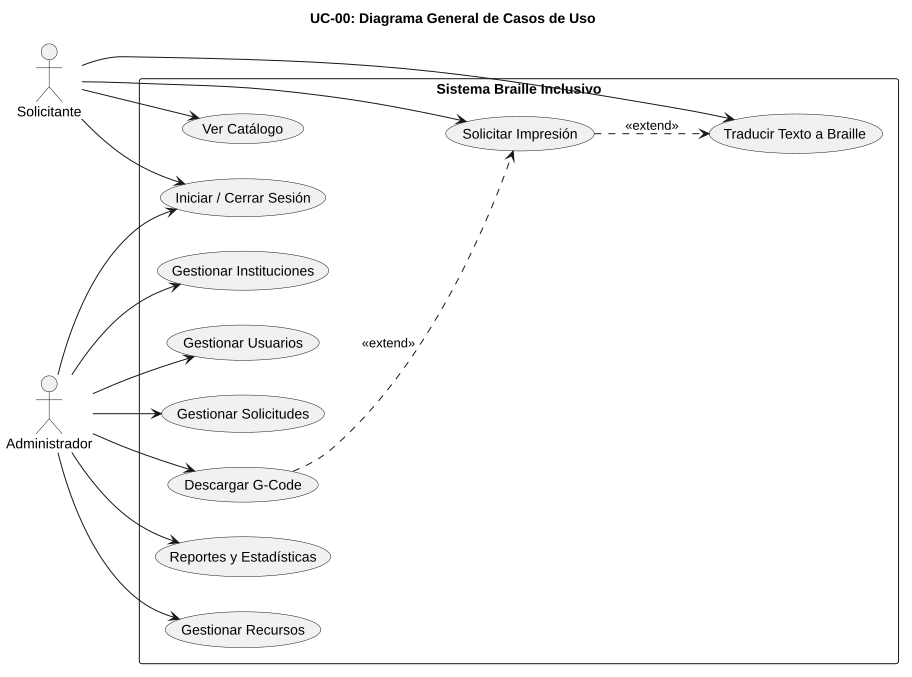Figura 3. Diagrama General de Casos de Uso

> Fuente: Elaboración propia.

- **Caso de uso: Iniciar/Cerrar Sesión**

> UC-01 permite a los dos tipos de usuario del sistema (Solicitante y Administrador) autenticarse mediante correo electrónico y contraseña encriptada con el algoritmo Bcrypt, y posteriormente cerrar su sesión de forma segura.
>
> Actor principal: Ambos (Solicitante y Administrador). Módulo: 1 — Gestión de Usuarios.
>
> Precondiciones: El usuario debe estar registrado en el sistema. Postcondiciones: Se establece una sesión activa que permite el acceso a las funcionalidades según el rol asignado.
>
> Flujo principal: (1) El usuario accede a la URL de login del sistema. (2) Ingresa su correo electrónico y contraseña. (3) El sistema valida las credenciales contra la tabla users de la base de datos. (4) Si las credenciales son correctas, se inicia sesión y se redirige al catálogo de recursos. (5) El cierre de sesión se realiza mediante el botón "Logout" disponible en todas las vistas autenticadas.

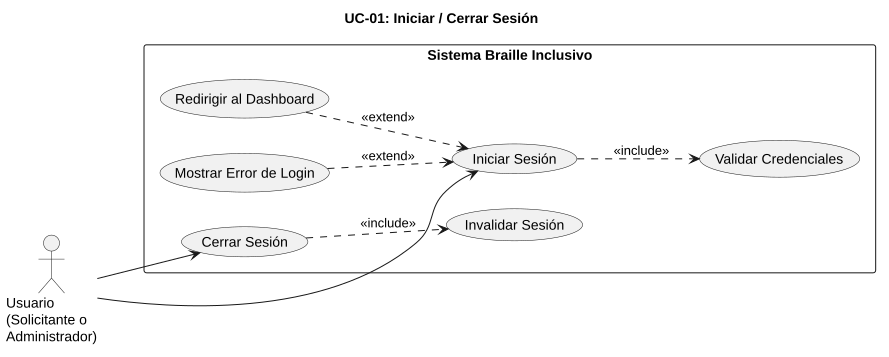Figura 4. UC-01: Iniciar/Cerrar Sesión

> Fuente: Elaboración propia.

- **Caso de uso: Gestionar Recursos**

> UC-02 agrupa las operaciones CRUD (Crear, Leer, Actualizar, Eliminar) que el Administrador puede realizar sobre los recursos educativos táctiles almacenados en el catálogo del sistema.
>
> Actor principal: Administrador. Módulo: 4 — Catálogo Digital de Producción Educativa Táctil.
>
> Precondiciones: El Administrador ha iniciado sesión en el sistema. Postcondiciones: El catálogo refleja los cambios realizados (creación, modificación, eliminación o restauración de un recurso).
>
> Flujo principal: El Administrador puede crear nuevos recursos ingresando título, descripción, gramos de PLA estimados, tiempo de impresión, imagen de referencia y archivo G-Code. También puede editar los datos de un recurso existente, enviarlo a la papelera de eliminación (SoftDelete), restaurarlo desde la papelera, o eliminarlo permanentemente. Todos los recursos inactivos no son visibles para el Solicitante en el catálogo público.

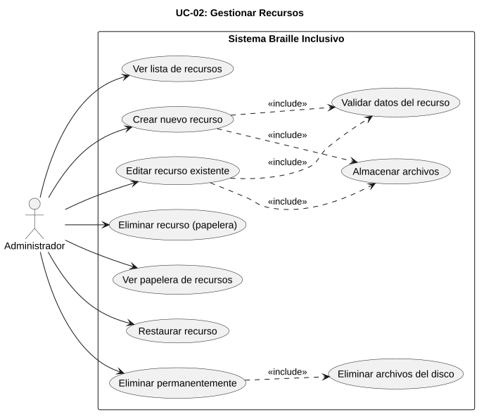Figura 5. UC-02: Gestionar Recursos

> Fuente: Elaboración propia.

- **Caso de uso: Ver Catálogo**

> UC-03 permite al Usuario Solicitante explorar y consultar el catálogo de recursos educativos táctiles disponibles para su impresión en 3D.
>
> Actor principal: Solicitante. Módulo: 4 — Catálogo Digital de Producción Educativa Táctil.
>
> Precondiciones: El Solicitante ha iniciado sesión en el sistema. Postcondiciones: El Solicitante visualiza la lista de recursos activos con sus fichas descriptivas.
>
> Flujo principal: (1) El Solicitante accede al módulo de catálogo. (2) El sistema muestra una lista paginada de todos los recursos en estado "Activo", con su imagen de referencia, título, tiempo estimado de impresión y peso en gramos. (3) El Solicitante puede filtrar los recursos por categoría (Matemáticas, Geografía, Braille, Ciencias) y buscar por nombre. (4) Al seleccionar un recurso, se muestra su ficha completa con la opción de "Solicitar Impresión".

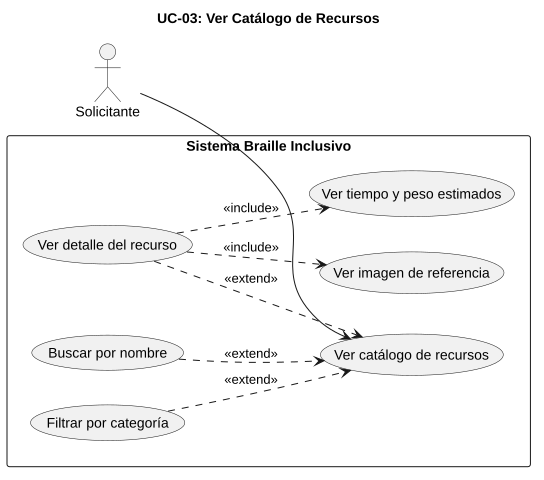Figura 6. UC-03: Ver Catálogo

> Fuente: Elaboración propia.

- **Caso de uso: Gestionar Instituciones**

> UC-04 permite al Administrador gestionar el registro de las instituciones educativas beneficiarias del proyecto, incluyendo su documentación de respaldo.
>
> Actor principal: Administrador. Módulo: 1 — Gestión de Usuarios (sección instituciones beneficiarias).
>
> Precondiciones: El Administrador ha iniciado sesión. Postcondiciones: La base de datos de instituciones refleja los cambios.
>
> Flujo principal: El Administrador puede registrar nuevas instituciones ingresando nombre, dirección, teléfono, director responsable, logo institucional (opcional) y documento PDF de respaldo (opcional). Cada institución puede ser posteriormente vinculada a los pedidos de impresión realizados por los usuarios Solicitantes asociados. Las operaciones disponibles incluyen crear, ver, editar, enviar a papelera, restaurar y eliminar permanentemente.

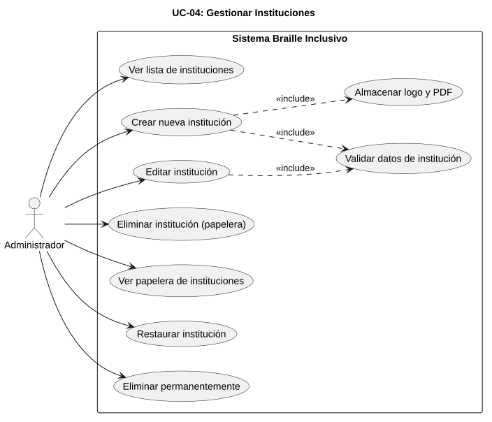Figura 7. UC-04: Gestionar Instituciones

> Fuente: Elaboración propia.

- **Caso de uso: Gestionar Usuarios**

> UC-05 permite al Administrador gestionar todas las cuentas de usuario del sistema, asignando roles y manteniendo el control de acceso.
>
> Actor principal: Administrador. Módulo: 1 — Gestión de Usuarios.
>
> Precondiciones: El Administrador ha iniciado sesión. Postcondiciones: Los cambios en las cuentas de usuario quedan registrados y afectan los permisos de acceso de los usuarios modificados.
>
> Flujo principal: El Administrador puede crear nuevos usuarios asignándoles un rol (Administrador o Solicitante), editar sus datos personales, restablecer contraseñas, enviar cuentas a la papelera de eliminación y restaurarlas. El sistema valida que el email sea único en la tabla users, que la contraseña tenga un mínimo de 8 caracteres y que el rol seleccionado sea uno de los valores permitidos en el enum del modelo User.

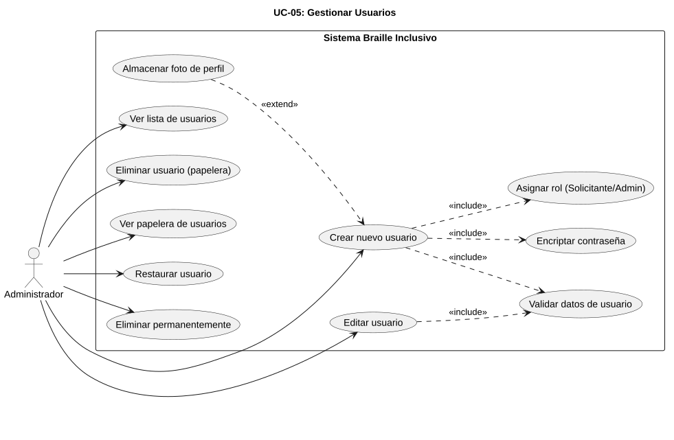Figura 8. UC-05: Gestionar Usuarios

> Fuente: Elaboración propia.

- **Caso de uso: Traducir Braille**

> UC-06 constituye el núcleo funcional (CORE) del sistema. Permite al Usuario Solicitante ingresar texto en español y obtener su representación táctil en Código Braille Español Grado 1, junto con una previsión visual 2D.
>
> Actor principal: Solicitante. Módulo: 2 — Traducción Automática Texto→Braille.
>
> Precondiciones: El Solicitante ha iniciado sesión. El texto ingresado contiene únicamente caracteres soportados por el Código Braille Español (letras A-Z, Ñ, vocales acentuadas Á É Í Ó Ú Ü, números 0-9 y puntuación estándar). Postcondiciones: El Solicitante visualiza la previsión 2D de la ficha Braille generada.
>
> Flujo principal: (1) El Solicitante accede al módulo "Traductor de Fichas". (2) Ingresa texto en español (ej: "ÑANDÚ"). (3) El sistema valida que todos los caracteres pertenezcan al alfabeto del Código Braille Español publicado por la ONCE. (4) El sistema traduce cada carácter a su celda Braille correspondiente. (5) Se muestra una previsión visual en 2D con la posición de los puntos Braille en relieve sobre la placa base.
>
> Importante: La generación del archivo G-Code NO ocurre en este caso de uso. La compilación del G-Code se realiza exclusivamente en UC-07 (Solicitar Impresión) al momento de confirmar el pedido.

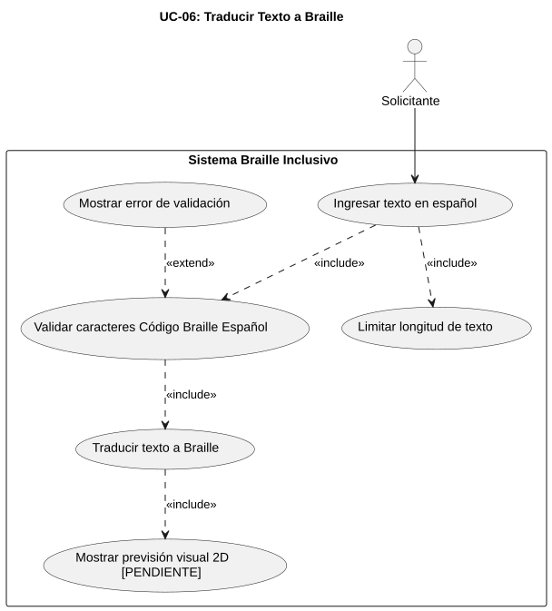Figura 9. UC-06: Traducir Texto a Braille

> Fuente: Elaboración propia.

- **Caso de uso: Solicitar Impresión**

> UC-07 permite al Solicitante confirmar la solicitud de impresión de un recurso educativo táctil, registrando el pedido y generando el archivo G-Code asociado.
>
> Actor principal: Solicitante. Módulo: 3 — Gestión de Pedidos y Costos de Producción.
>
> Precondiciones: El Solicitante ha visualizado la previsión 2D (UC-06) o ha seleccionado un recurso del catálogo (UC-03). Postcondiciones: Se registra un nuevo pedido en estado "Pendiente" con su archivo G-Code generado y asociado.
>
> Flujo principal: (1) El Solicitante confirma la solicitud haciendo clic en "Solicitar Impresión". (2) El sistema registra el pedido asociando el usuario, la institución de origen, la fecha y los datos del recurso. (3) El sistema calcula el consumo estimado de filamento PLA en gramos utilizando los parámetros volumétricos del modelo. (4) Se estima el costo de producción multiplicando los gramos de PLA por el costo por gramo parametrizado en la tabla configuracion_sistemas. (5) El sistema genera las coordenadas espaciales (X, Y, Z) para el extrusor. (6) Se compila el archivo .gcode con instrucciones G0/G1, control de extrusión G92 E0 y parámetros compatibles con Marlin 1.1.x. (7) Se asigna el estado "Pendiente" al pedido y se almacena la ruta del archivo G-Code en el campo gcode_path de la tabla pedidos.

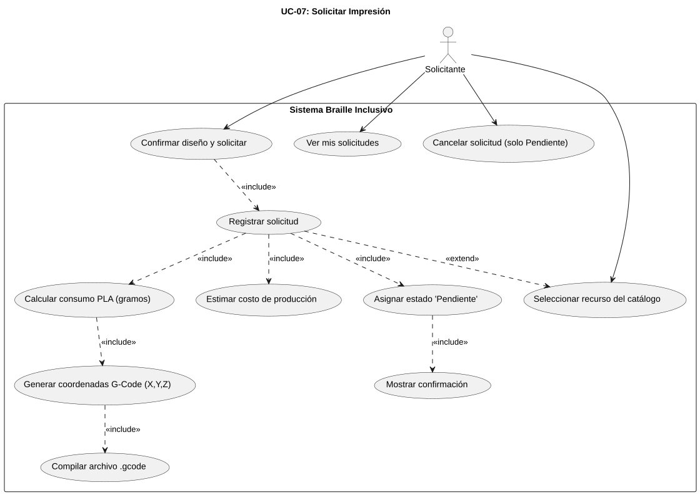Figura 10. UC-07: Solicitar Impresión

> Fuente: Elaboración propia.

- **Caso de uso: Gestionar Solicitudes**

> UC-08 permite al Administrador consultar, filtrar y actualizar el estado de todos los pedidos de impresión solicitados por los usuarios.
>
> Actor principal: Administrador. Módulo: 3 — Gestión de Pedidos y Costos de Producción.
>
> Precondiciones: El Administrador ha iniciado sesión. Existen pedidos registrados en el sistema. Postcondiciones: El estado del pedido se actualiza según la acción del Administrador.
>
> Flujo principal: El Administrador accede al panel de gestión de solicitudes, donde puede ver una lista paginada y filtrable de todos los pedidos por estado (Pendiente, Aprobado, En impresión, Completado, Rechazado), institución y fecha. Para cada pedido, el Administrador puede: (1) Cambiar el estado a "En impresión" cuando inicia el proceso físico. (2) Cambiar el estado a "Completado" cuando la impresión finaliza. (3) Rechazar el pedido registrando un motivo obligatorio en el campo motivo_rechazo. (4) Descargar el archivo G-Code asociado para transferirlo a la impresora 3D.

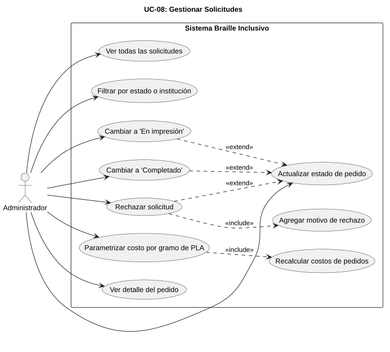Figura 11. UC-08: Gestionar Solicitudes

> Fuente: Elaboración propia.

- **Caso de uso: Descargar G-Code**

UC-09 permite exclusivamente al Administrador descargar los archivos G-Code generados para los pedidos aprobados, con el fin de transferirlos manualmente a la impresora 3D mediante conexión USB directa desde la PC del operador.

Actor principal: Administrador. Módulo: 3/4 — Gestión de Pedidos y Catálogo de Recursos.

Precondiciones: El Administrador ha iniciado sesión. El pedido tiene un archivo G-Code generado y asociado. Postcondiciones: El archivo G-Code se descarga al equipo local del operador, listo para ser transferido por USB a la impresora 3D.

Flujo principal: (1) El Administrador accede al detalle de un pedido en estado "Pendiente", "Aprobado" o "En impresión". (2) Hace clic en el botón "Descargar G-Code". (3) El sistema sirve el archivo desde la ruta almacenada en gcode_path. (4) El operador guarda el archivo y lo transfiere mediante USB directo (Tethered Printing) a la placa controladora Arduino Mega 2560 + RAMPS 1.4.

Restricción crítica: El Solicitante NUNCA puede descargar archivos G-Code. Esta restricción se implementa mediante middleware de roles que valida que el usuario autenticado tenga rol "Administrador".

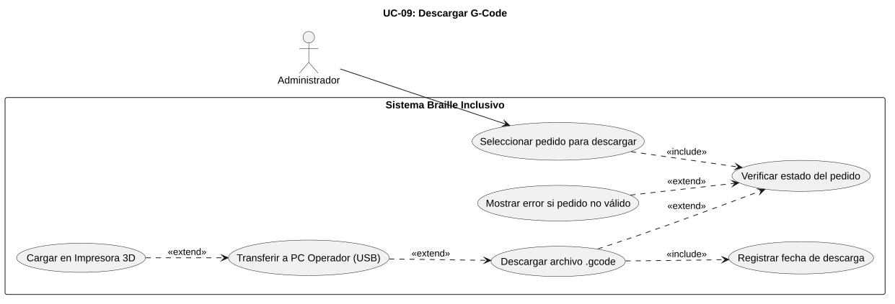Figura 12. UC-09: Descargar G-Code

> Fuente: Elaboración propia.

- **Caso de uso: Reportes y Estadísticas**

UC-10 permite al Administrador generar reportes en formatos PDF y Excel de los registros de recursos, instituciones, usuarios y pedidos del sistema.

Actor principal: Administrador. Módulo: 3 — Gestión de Pedidos y Costos de Producción.

Precondiciones: El Administrador ha iniciado sesión. Postcondiciones: Se genera y descarga un archivo PDF o Excel con la información consolidada.

Flujo principal: El Administrador accede al módulo de reportes y selecciona la entidad a reportar (recursos, instituciones, usuarios o pedidos) y el formato de exportación (PDF mediante DomPDF o Excel mediante Maatwebsite/Excel). El sistema genera el documento correspondiente con los datos actuales de la base de datos, respetando los filtros aplicados (por ejemplo, pedidos por rango de fechas o por estado). Los reportes son de uso exclusivo del Administrador para la toma de decisiones y el control de gestión.

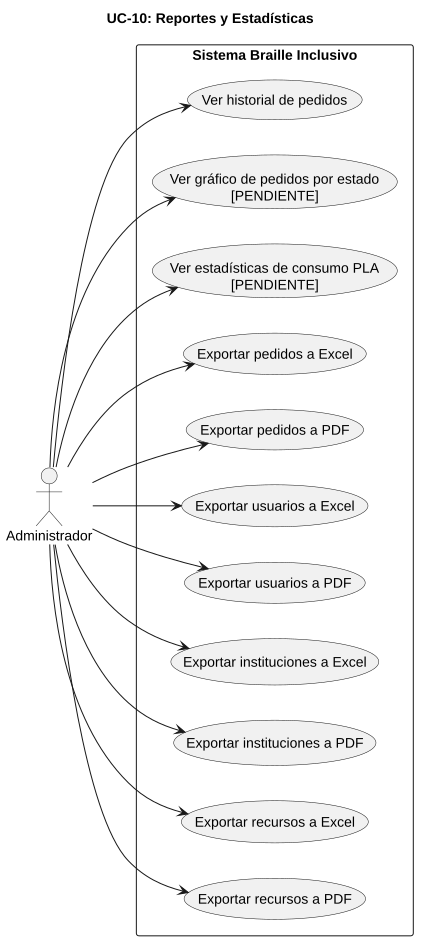Figura 13. UC-10: Reportes y Estadísticas

> Fuente: Elaboración propia.

- **Diagrama de Clases**

> El Diagrama de Clases del Dominio representa las 7 clases principales del modelo de datos del sistema, junto con 3 enums que definen los valores permitidos para los campos rol, estado del recurso y estado del pedido. Las clases representadas son: User (gestión de usuarios con autenticación Bcrypt), Institucion (instituciones beneficiarias), Recurso (catálogo de modelos educativos con su relación a Categoria), Categoria (clasificación de recursos), Pedido (solicitudes de impresión con SoftDeletes), DetallePedido (líneas de cada pedido) y ConfiguracionSistema (parámetros clave-valor como el precio por gramo de PLA). Las relaciones de asociación incluyen: User 1:N Pedido, Institucion 1:N Pedido, Pedido 1:N DetallePedido, Recurso 1:N DetallePedido y Categoria 1:N Recurso. Los atributos SoftDeletes (papelera de eliminación) están marcados en las clases User, Institucion, Recurso y Pedido.

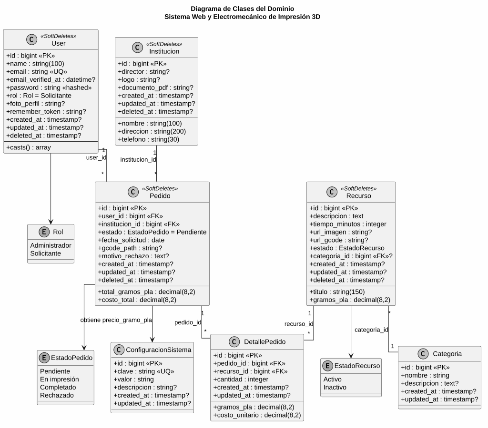Figura 14. Diagrama de Clases

- Fuente: Elaboración propia.

- **Estados**

> El Diagrama de Estados representa el ciclo de vida de un Pedido en el sistema. El estado inicial es "Pendiente", asignado automáticamente al crear el pedido (UC-07). Desde este estado, el Administrador puede: (a) aprobar la solicitud pasando al estado "Aprobado", o (b) rechazar el pedido registrando un motivo obligatorio. Desde "Aprobado", el Administrador actualiza a "En impresión" al iniciar el proceso físico de fabricación 3D. Desde "En impresión", puede marcarlo como "Completado" cuando finaliza. Adicionalmente, el Solicitante puede cancelar un pedido solo si el estado es "Pendiente" mediante SoftDelete.

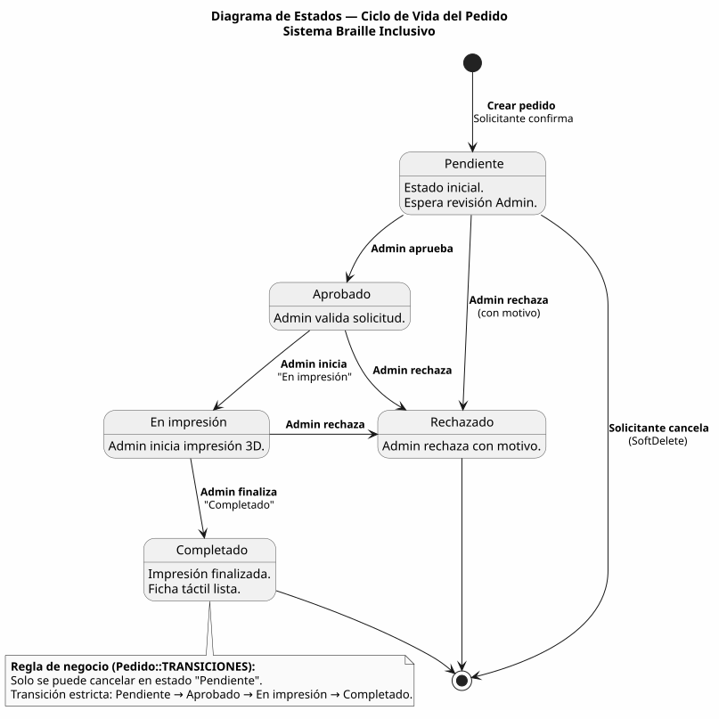Figura 15. Diagrama de Estados del Pedido

- Fuente: Elaboración propia.

- **Componentes**

> El Diagrama de Despliegue muestra la topología física del sistema distribuido en cuatro nodos principales: (1) Servidor en la Nube que aloja Laravel 13, MySQL 8.0 y el Service BrailleTranslator (PHP); (2) PC del Solicitante con navegador web estándar; (3) PC del Operador con navegador y software de control USB; y (4) la Placa Controladora Arduino Mega 2560 + RAMPS 1.4 que ejecuta el Firmware Marlin 1.1.x. La comunicación entre los nodos sigue el siguiente patrón: las PCs del Solicitante y del Operador se conectan al servidor mediante Internet/HTTPS; el Operador conecta la placa controladora mediante Cable USB / Serial; la placa controla los motores NEMA 17, los drivers A4988 y el extrusor MK8. No existe comunicación directa entre el servidor en la nube y la impresora 3D.

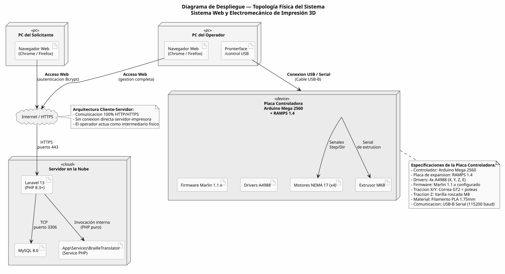Figura 16. Diagrama de Despliegue (Topología Física)

- Fuente: Elaboración propia.

- **Base de datos**

> El Diagrama Entidad-Relación de Base de Datos (Figura 17) refleja exactamente las 7 tablas implementadas en MySQL: users, instituciones, categorias, recursos, pedidos, detalle_pedidos y configuracion_sistemas. La tabla users almacena las cuentas del sistema con campos para autenticación Bcrypt, roles (enum Administrador, Solicitante) y softDelete. La tabla instituciones guarda los centros educativos beneficiarios con su documentación. La tabla categorias clasifica los recursos del catálogo. La tabla recursos almacena los modelos educativos con sus datos técnicos (gramos_pla, tiempo_minutos), referencia a categoría y softDelete. La tabla pedidos registra las solicitudes con su estado, fecha, costos y referencia al archivo G-Code generado. La tabla detalle_pedidos permite registrar múltiples recursos por pedido (relación 1:N). La tabla configuracion_sistemas implementa el patrón clave-valor para parámetros globales como precio_gramo_pla. Las 5 claves foráneas del modelo son:

- pedidos.user_id →users.id (CASCADE),

- pedidos.institucion_id → instituciones.id (SET NULL)

- detalle_pedidos.pedido_id→pedidos.id(C ASCADE)

- detalle_pedidos.recurso_id →recursos.id (CASCADE)

- recursos.categoria_id → categorias.id (SET NULL).

Figura 17. Diagrama ER de Base de Datos.

- Fuente: Elaboración propia.

### Tecnologías utilizadas

El sistema se desarrolló íntegramente con tecnologías de código abierto. En el backend se utilizó el framework Laravel 13 sobre PHP 8.3, con el patrón MVC y el ORM Eloquent para la base de datos MySQL 8.0. El frontend se construyó con AdminLTE 3 (Bootstrap 4), con interfaz responsiva y accesible conforme a WCAG 2.1 nivel AA. El algoritmo de traducción texto→Braille Grado 1 (Código Braille Español de la ONCE) y la generación de archivos G-Code se implementan como Service class de Laravel en PHP (App\Services\BrailleTranslator), integrados al flujo de pedidos de la plataforma (decisión de arquitectura: PHP puro). El entorno de desarrollo y despliegue se gestionó con Docker/Compose, el control de versiones con Git/GitHub y la planificación con Trello bajo la metodología Scrum/Kanban. La exportación de reportes se realizó con DomPDF (PDF) y Maatwebsite/Excel (hojas de cálculo). En el componente de hardware, el control se realiza con el firmware Marlin 1.1.x sobre un Arduino Mega 2560 con shield RAMPS 1.4, cuatro drivers A4988 y cuatro motores NEMA 17 recuperados de e-waste, con extrusor MK8 y boquilla de 0.8 mm.

## **Herramientas de seguimiento**

El seguimiento del proyecto se realizó mediante un tablero Kanban en Trello con las columnas «Por Hacer», «En Progreso», «Revisión», «Bloqueado» y «Hecho», complementado con la metodología Scrum mediante sprints quincenales, reuniones diarias breves y retrospectivas al cierre de cada iteración. El avance del código fuente se controló con Git/GitHub a través de ramas y pull requests, y la revisión del tutor quedó documentada en el repositorio del proyecto.

## Dificultades y soluciones aplicadas

Durante la ejecución se presentaron las siguientes dificultades, resueltas según el plan de riesgos definido: (a) Baja adherencia del filamento PLA sobre la cama de impresión: se calibró la distancia inicial del eje Z (boquilla a 0.1 mm), se niveló la cama y se aplicó cinta azul de pintor para mejorar la fijación de la primera capa. (b) Desincronización de motores NEMA 17: se ajustó individualmente la corriente de cada driver A4988 y se verificaron los parámetros steps/mm del firmware Marlin (X=80, Y=80, Z=2560, E=95). (c) Componentes e-waste defectuosos: se aplicaron pruebas de continuidad y medición de bobinas a todos los motores recuperados antes del ensamblaje, descartando las piezas no funcionales. (d) Accesibilidad de la plataforma: se realizaron pruebas iterativas de contraste y navegación por teclado para cumplir WCAG 2.1 nivel AA.

# RESULTADOS OBTENIDOS

## Resultados cualitativos

\<Pendiente\>

## Resultados cuantitativos

\<Pendiente\>

## Impacto en la comunidad

\<Pendiente\>

# CONCLUSIONES

\<Pendiente\>

# Recomendaciones

\<Pendiente\>

# FUENTES DE INFORMACIÓN Y BIBLIOGRAFÍA

Arduino AG. (2023). *Arduino Mega 2560 Rev3 — Documentación técnica.* https://docs.arduino.cc/

Braille Authority of North America. (2013). *Size and Spacing of Braille Characters.* https://www.brailleauthority.org/

*Constitución Política del Estado Plurinacional de Bolivia.* (2009). Gaceta Oficial del Estado Plurinacional de Bolivia.

*Decreto Supremo N° 1893. Reglamento de la Ley N° 223 — Ley General para Personas con Discapacidad.* (2014). Gaceta Oficial del Estado Plurinacional de Bolivia.

Ellen MacArthur Foundation. (2013). *Hacia una economía circular: razones económicas para una transición acelerada.* https://www.ellenmacarthurfoundation.org/

Evans, B. (2021). *Practical 3D Printers: The Science and Art of 3D Printing.* Apress.

Gibson, I., Rosen, D., Stucker, B., y Khorasani, M. (2015). *Additive Manufacturing Technologies: 3D Printing, Rapid Prototyping, and Direct Digital Manufacturing* (2.ª ed.). Springer.

Hernández-Sampieri, R., Fernández-Collado, C., y Baptista-Lucio, P. (2014). *Metodología de la investigación* (6.ª ed.). McGraw-Hill.

Instituto Nacional de Estadística. (2012). *Censo Nacional de Población y Vivienda 2012.* https://www.ine.gob.bo/

ISO/ASTM 52900. (2021). *Additive manufacturing — General principles — Fundamentals and vocabulary.* International Organization for Standardization.

JetBrains. (2023). *Developer Ecosystem Survey 2023.* https://www.jetbrains.com/lp/devecosystem-2023/

*Ley N° 070 — Ley de Educación «Avelino Siñani – Elizardo Pérez».* (2010). Asamblea Legislativa Plurinacional de Bolivia.

*Ley N° 223 — Ley General para Personas con Discapacidad.* (2012). Asamblea Legislativa Plurinacional de Bolivia.

Marlin Contributors. (2023). *Marlin Firmware Documentation (v1.1.x).* https://marlinfw.org/

Mellor, C. M. (2006). *Louis Braille: A Touch of Genius.* National Braille Press.

Ministerio de Educación de Bolivia. (2018). *Guía de educación inclusiva para personas con discapacidad.* La Paz: Ministerio de Educación.

Naciones Unidas. (2015). *Transformar nuestro mundo: la Agenda 2030 para el Desarrollo Sostenible (ODS 4).* https://www.un.org/sustainabledevelopment/es/

Organización Mundial de la Salud. (2023). *Informe mundial sobre la visión.* Ginebra: OMS. https://www.who.int/es/

Organización Nacional de Ciegos Españoles (ONCE). (s. f.). *Código Braille Español.* https://www.once.es/

OWASP Foundation. (2021). *OWASP Top Ten — 2021.* https://owasp.org/www-project-top-ten/

Ponce Talancón, H. (2006). La matriz FODA: una alternativa para realizar diagnósticos y determinar estrategias de intervención en las organizaciones. *Contribuciones a la Economía.* http://www.eumed.net/ce/

Pressman, R. S., y Maxim, B. R. (2020). *Ingeniería del software: un enfoque práctico* (9.ª ed.). McGraw-Hill.

RepRap Community. (2005). *RepRap — Replicating Rapid Prototyper.* https://reprap.org/

*Resolución Ministerial N° 0487/2023. Reglamento de Modalidades de Graduación del Subsistema de Educación Superior de Formación Profesional.* (2023). Ministerio de Educación de Bolivia.

Schwaber, K., y Sutherland, J. (2020). *La Guía de Scrum: la guía definitiva de Scrum.* https://scrumguides.org/

W3C. (2018). *Web Content Accessibility Guidelines (WCAG) 2.1.* https://www.w3.org/TR/WCAG21/

# ANEXOS

Anexo A: Glosario de términos técnicos (Braille, PLA, FDM, G-Code, e-waste, microstepping, dot pitch, MVC, WCAG, Scrum, Kanban).

Anexo B: Diagrama del Árbol de Problemas — representación gráfica del problema central, sus causas raíz y sus consecuencias observadas.

Anexo C: Formulario de encuesta sobre la impresión 3D Braille orientada a docentes de educación especial (12 preguntas, escala de Likert de 5 puntos).

Anexo D: Formulario de encuesta sobre material táctil en Braille orientada a estudiantes con discapacidad visual (8 preguntas, respuesta dicotómica y abierta).

Anexo E: Manual de operación y mantenimiento de la máquina— guía ilustrada para calibración de ejes, cambio de filamento PLA, limpieza del extrusor y solución de problemas frecuentes.

Anexo F: Diagramas UML del sistema web — casos de uso, clases del dominio, secuencia (traducción Braille y generación G-Code) y despliegue.

Anexo G: Planos del chasis cartesiano con dimensiones en milímetros (vistas frontal, lateral y superior).

Anexo H: Resultados completos de las pruebas piloto — tabulación de encuestas, observaciones recibidas y acciones de mejora implementadas.

Anexo J: Fotografías del proceso de ensamblaje, pruebas de calibración y sesiones de validación comunitaria.
